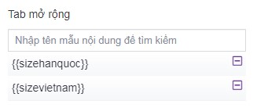
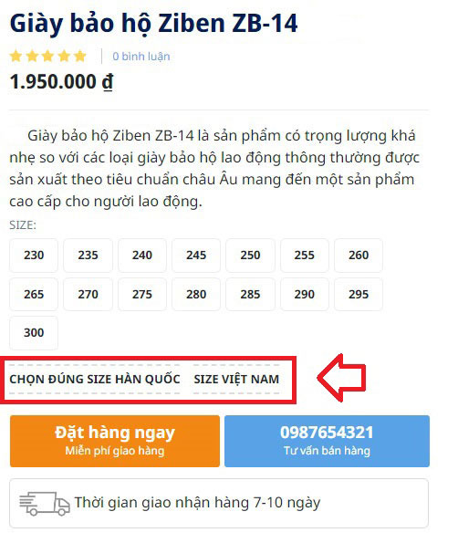

# Nhóm sản phẩm

- Nhóm sản phẩm: cho phép tạo nhiều nhóm những sản phẩm cùng loại với nhau tùy theo mục đích.
- Một nhóm sản phẩm có liên kết mật thiết chặt chẽ với các sản phẩm cùng loại.
- Hướng dẫn sử dụng tính năng trình soạn thảo: xem thêm [tại đây](https://pisale.osd.vn/docs/common/tinymce)
- Hướng dẫn sử dụng trình quản lý file: xem thêm [tại đây](https://pisale.osd.vn/docs/common/finder)

## Thêm một nhóm sản phẩm

Để thêm một nhóm sản phẩm, bạn cần:

Nhấn chọn **Nội dung -> Nhóm và danh mục -> Nhóm sản phẩm**. Nhấn chọn nút **Thêm** để thêm mới 1 mục.

Những thông tin cụ thể cần điền như sau:

_Chú ý: Bạn bắt buộc phải nhập tên cho nhóm sản phẩm._

**Tên nhóm sản phẩm**

Mỗi nhóm sản phẩm được tạo sẽ có 1 đường dẫn địa chỉ website, tại địa chỉ URL đó sẽ hiển thị những bài sản phẩm mà bạn đã thêm vào.

**Phụ đề**

Nhập tên phụ đề cho nhóm sản phẩm

**Mô tả phía trên**

Nhập mô tả cho nhóm sản phẩm. Được hiển thị phía trên danh sách các bài sản phẩm.

**Mô tả phía dưới**

Nhập mô tả cho nhóm sản phẩm. Được hiển thị phía dưới danh sách các bài sản phẩm.

**Ảnh đại diện/Banner**

Chọn duyệt file, sau đó chọn thư mục ảnh tương ứng để upload ảnh lên trình quản lý file.

**Cấp danh mục cha**

Chọn danh mục cấp cha cho danh mục này nếu danh mục này không có danh mục cha thì sẽ là danh mục lớn nhất. Bạn nhập tên danh mục sản phẩm, hệ thống gợi ý tên danh mục để bạn lựa chọn.

**Nổi bật**

Tích chọn nếu muốn hiển thị nhóm danh mục sản phẩm lên trang chủ website. Thêm 1 bước cấu hình mô đun nhóm sản phẩm [tại đây](https://pisale.osd.vn/docs/design/module/category)

Xem thêm [tại đây](https://pisale.osd.vn/docs/common/logic#m%E1%BB%A5c-n%E1%BB%95i-b%E1%BA%ADt)

**Tab mở rộng**
Nhập tên mẫu nội dung để tìm kiếm. Mẫu nội dung được thiết lập cấu hình [tại đây](https://pisale.osd.vn/docs/setting/pattern/#th%C3%AAm-m%E1%BA%ABu-n%E1%BB%99i-dung)

**Thứ tự**

Xem thêm [tại đây](https://pisale.osd.vn/docs/common/logic#th%E1%BB%A9-t%E1%BB%B1-s%E1%BA%AFp-x%E1%BA%BFp-l%C3%A0-s%E1%BB%91-ch%E1%BB%89-%C4%91%E1%BB%8Bnh)

**Trạng thái**

Xem thêm [tại đây](https://pisale.osd.vn/docs/common/logic/#tr%E1%BA%A1ng-th%C3%A1i-v%C3%A0-xu%E1%BA%A5t-b%E1%BA%A3n)

_Chỉnh sửa SEO để tối ưu trên các công cụ tìm kiếm bao gồm Meta title, Meta keyword, Meta Description_

Xem thêm [tại đây](https://pisale.osd.vn/docs/seo/serp)

Nhấn chọn nút **Lưu** để lưu lại 1 mục.

## Xóa nhóm sản phẩm

Để xóa một nhóm sản phẩm, tích vào nhóm sản phẩm đó và chọn **Xóa** từ danh sách checkbox bên trái hoặc click nút **Xóa nhóm sản phẩm** trong mỗi nhóm sản phẩm chi tiết.

Xem thêm [tại đây](https://pisale.osd.vn/docs/common/logic#x%C3%B3a-c%C3%A1c-m%E1%BB%A5c-c%C3%A1c-th%C3%A0nh-ph%E1%BA%A7n-th%C3%B4ng-tin)

## Sửa nhóm sản phẩm

Nhấn chọn nhóm sản phẩm muốn sửa, bạn cần nhập nội dung cần thay thế sau đó chọn nút **Lưu** để hoàn tất.
