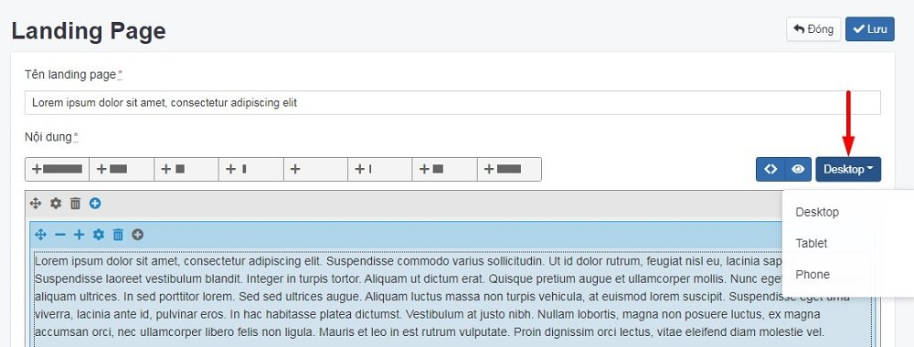
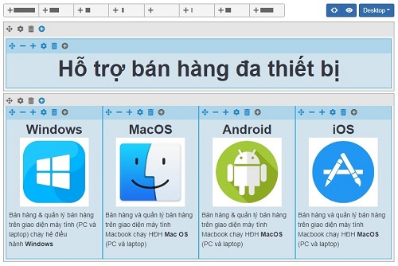
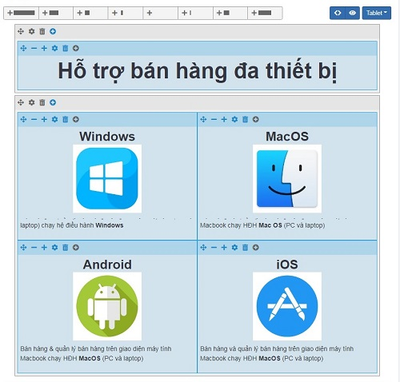
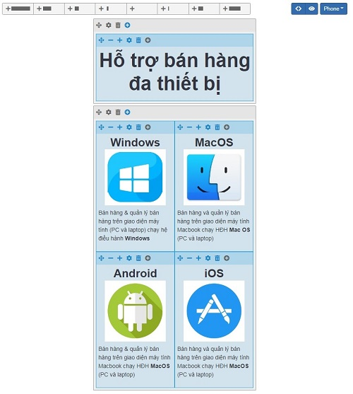
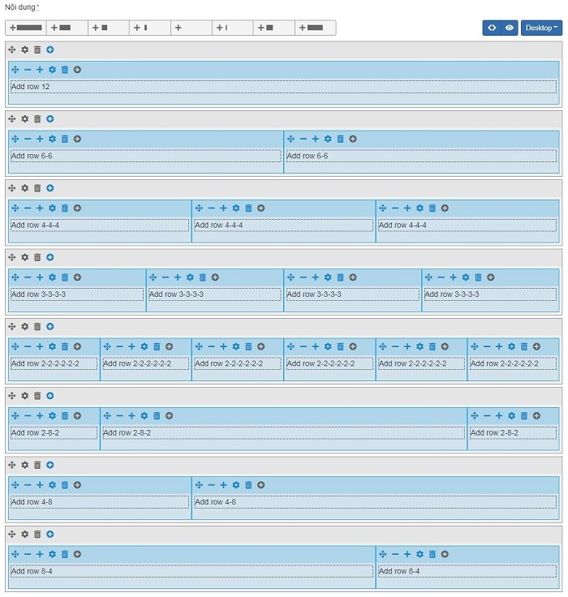

# Longform

Longform là định dạng thể hiện kiểu tạp chí với đồ hoạ đẹp, hình ảnh chất lượng cao. Độc giả có thể tìm thấy chân dung nhân vật, các vấn đề thời sự, một cuộc điều tra hay các trải nghiệm cá nhân.

## Thêm mới longform

Để thêm một nhóm longform, bạn cần:

Nhấn chọn **Nội dung -> Longform**. Nhấn chọn nút **Thêm** để thêm mới 1 mục.

Bạn thêm các bài longform theo nhiều định dạng form khác nhau. Bạn có thể tùy chỉnh 3 phiên bản **Desktop, Tablet, Mobile** nhấn chọn vào danh sách thả xuống và chọn phiên bản **Desktop, Tablet, Mobile** tương ứng, sau đó nhấn chọn dấu cộng tại mỗi hàng để tùy chỉnh kích thước mỗi box tương ứng hiển thị trên màn hình.

Tùy chỉnh màn hình Desktop:

Tùy chỉnh màn hình Tablet:

Tùy chỉnh màn hình Mobile:

Những thông tin cụ thể cần điền như sau:

**Tên longform**

Nhập tên bài viết bạn muốn hiển thị trên wesbite

**Nội dung**

Mô tả chi tiết bài thông tin để người dùng hiểu rõ hơn về lĩnh vực của bạn đang kinh doanh. Có 8 loại tab nội dung theo 8 cách hiển thị khác nhau như sau:

- Add row 12
- Add row 6-6
- Add row 4-4-4
- Add row 3-3-3-3
- Add row 2-2-2-2-2-2
- Add row 2-8-2
- Add row 4-8
- Add row 8-4

Hình minh họa mỗi tab được hiển thị lần lượt như sau:

**Edit Source Code**

Chỉnh sửa nội dung bằng source code

**Preview**

Xem trước

**Tùy chỉnh 3 phiên bản**

Desktop, Tablet, Mobile

**Ảnh đại diện**

Nhấp chọn ảnh để lựa chọn tập tin hình ảnh bài thông tin và tải lên

**Thứ tự**

Xem thêm [tại đây](https://pisale.osd.vn/docs/common/logic#th%E1%BB%A9-t%E1%BB%B1-s%E1%BA%AFp-x%E1%BA%BFp-l%C3%A0-s%E1%BB%91-ch%E1%BB%89-%C4%91%E1%BB%8Bnh)

**Xuất bản**

Xem thêm [tại đây](https://pisale.osd.vn/docs/common/logic/#tr%E1%BA%A1ng-th%C3%A1i-v%C3%A0-xu%E1%BA%A5t-b%E1%BA%A3n)

Chỉnh sửa SEO để tối ưu trên các công cụ tìm kiếm bao gồm Meta title, Meta keyword, Meta Description_

Xem thêm [tại đây](https://pisale.osd.vn/docs/seo/serp)

**Mã nhúng**

Đối với dịch vụ của những bên thứ 3, bạn cần dán mã nhúng tại đây nếu muốn hiển thị mã nhúng cho bài viết này.

Nhấn chọn nút **Lưu** để lưu lại 1 mục.

## Xóa longform

### Xóa 1 bài longform

Tích chọn bài bạn muốn xóa tại danh sách bài longform và chọn Xóa.

### Xóa 1 cột nội dung trong bài longform

Nhấn chọn icon thùng rác tại mỗi cột nội dung. 

Xem thêm [tại đây](https://pisale.osd.vn/docs/common/logic#x%C3%B3a-c%C3%A1c-m%E1%BB%A5c-c%C3%A1c-th%C3%A0nh-ph%E1%BA%A7n-th%C3%B4ng-tin)

## Sửa bài longform

Nhấn chọn bài longform cần sửa, sau khi thay đổi thông tin nội dung bài viết, bạn cần nhấn nút **Lưu** để cập nhật.
