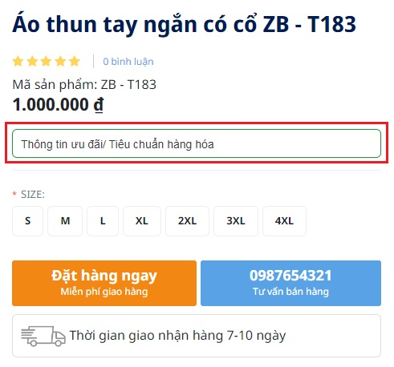
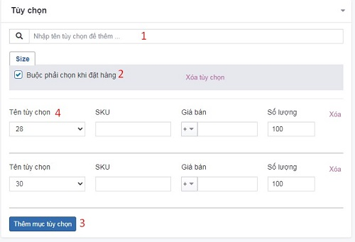
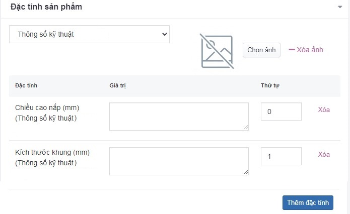

# Sản phẩm

- Hướng dẫn sử dụng tính năng trình soạn thảo: xem thêm [tại đây](https://pisale.osd.vn/docs/common/tinymce)
- Hướng dẫn sử dụng trình quản lý file: xem thêm [tại đây](https://pisale.osd.vn/docs/common/finder)
 
# Thêm bài sản phẩm mới

Để thêm một bài sản phẩm, bạn cần:

Nhấn chọn **Nội dung -> Sản phẩm**. Nhấn chọn nút **Thêm** để thêm mới 1 mục.

Những thông tin cụ thể cần điền như sau:

_Chú ý: Bạn bắt buộc phải nhập tên cho bài sản phẩm._

**Tên sản phẩm**

Nhập tên sản phẩm bạn muốn hiển thị trên wesbite

**Mô tả ngắn**

Nhập mô tả cho sản phẩm. Độ dài khoảng 160-320 ký tự.

**Mô tả chi tiết**

Nhập nội dung mô tả chi tiết cho bài viết.

**Thông tin ưu đãi/ Tiêu chuẩn hàng hóa**

Nhập thông tin ưu đãi cho sản phẩm

**Thư viện ảnh**

Xem thêm [tại đây](https://pisale.osd.vn/docs/common/logic/#th%C6%B0-vi%E1%BB%87n-%E1%BA%A3nh)

**Giá bán**

Là biểu hiện bằng tiền của giá trị hàng hoá, nghĩa là số lượng tiền phải trả cho một sản phẩm.

**Model**

Là một dạng quy ước giúp phân loại sản phẩm.

**Nổi bật**

Xem thêm [tại đây](https://pisale.osd.vn/docs/common/logic#m%E1%BB%A5c-n%E1%BB%95i-b%E1%BA%ADt)

**Ngày xuất bản**

Lựa chọn ngày xuất bản cho bài sản phẩm

**Số lượng**

Nhập số lượng cho sản phẩm. Điền số 0 thì khi xem ngoài sản phẩm sẽ hiển thị tình trạng là **Tạm hết hàng**

**Mua tối thiểu**

Số lượng ít nhất khi đặt hàng

**Trọng lượng**

Điền trọng lượng của sản phẩm, đơn vị tính là kg hoặc gram

**Xuất bản**

Xem thêm [tại đây](https://pisale.osd.vn/docs/common/logic/#tr%E1%BA%A1ng-th%C3%A1i-v%C3%A0-xu%E1%BA%A5t-b%E1%BA%A3n)

**Thứ tự**

Xem thêm [tại đây](https://pisale.osd.vn/docs/common/logic#th%E1%BB%A9-t%E1%BB%B1-s%E1%BA%AFp-x%E1%BA%BFp-l%C3%A0-s%E1%BB%91-ch%E1%BB%89-%C4%91%E1%BB%8Bnh)

**Nhóm sản phẩm**

Chọn nhóm sản phẩm đã được tạo [tại đây](https://pisale.osd.vn/docs/catalog/category). Hạn chế thêm sản phẩm vào nhiều nhóm sản phẩm có cùng cấp.

**Hãng sản xuất**

Chọn hãng sản xuất đã được tạo [tại đây](https://pisale.osd.vn/docs/catalog/manufacturer)

**Tag**

Nhập từ khóa cho sản phẩm và ngăn cách nhau bằng dấu phẩy

**Sản phẩm liên quan/Tin bài liên quan**

Bạn cần gõ tên bài cụ thể hoặc gõ số 0 hệ thống sẽ lọc danh sách cho bạn lựa chọn bài phù hợp

**Tùy chọn**

- Nhập tên tùy chọn để thêm (1)
- Tích tại trường "Buộc phải chọn khi đặt hàng" (2)
- Thêm mục tùy chọn (3)

_Các trường tùy chọn cần nhập nội dung như sau:_

- **Tên tùy chọn**: chọn tùy chọn đã được thiết lập [tại đây](https://pisale.osd.vn/docs/catalog/option) (4)
- **SKU**: đơn vị quản lý kho
- **Giá bán**: lựa chọn đơn vị + hoặc - và nhập giá bán cho mỗi tùy chọn tương ứng. Ví dụ
- **Số lượng**: nhập số lượng cho tùy chọn sản phẩm
- **Xóa**: nhấn nút xóa để **Xóa** 1 tùy chọn
- **Xóa tùy chọn**: nhấn nút **Xóa tùy chọn** để xóa nhóm tùy chọn đó
- **Thêm mục tùy chọn**: nhân chọn thêm để thêm nhiều tùy chọn khác nhau

**Khuyến mại**
- **Ưu tiên**: Điền số thứ tự cho từng mốc khuyến mại
- **Giá bán**: Điền giá khuyến mại
- **Từ ngày**: Chọn ngày bắt đầu khuyến mại
- **Đến ngày**: Chọn ngày kết thúc khuyến mại
- **Thêm Giá khuyến mại**: Nhấn chọn để thêm nhiều khuyến mãi theo từng mốc thời gian

**Đặc tính sản phẩm**

Nhấn chọn **Thêm nhanh theo nhóm** để lựa chọn nhóm đặc tính và đặc tính của sản phẩm

- **Chọn ảnh**: nhấn chọn nút **Chọn ảnh** để tải ảnh của nhóm đặc tính
- **Đặc tính**: được hiển thị tự động theo nhóm đặc tính đã thiết lập [tại đây](https://pisale.osd.vn/docs/catalog/attribute)
- **Giá trị**: nhập giá trị mỗi đặc tính
- **Thứ tự**: xem thêm [tại đây](https://pisale.osd.vn/docs/common/logic/#th%E1%BB%A9-t%E1%BB%B1-s%E1%BA%AFp-x%E1%BA%BFp-l%C3%A0-s%E1%BB%91-ch%E1%BB%89-%C4%91%E1%BB%8Bnh)
- **Thêm đặc tính**: nhấn chọn thêm để thêm đặc tính. Cần chọn nhóm đặc tính và đặc tính tương ứng
- **Xóa ảnh**: nhấn chọn nút **Xóa ảnh** để xóa ảnh đại diện của nhóm đặc tính
- **Xóa**: nhấn chọn nút **Xóa** để xóa đặc tính

**Câu hỏi thường gặp**

Xem thêm [tại đây](https://pisale.osd.vn/docs/common/faqs)

**Seo**

_Chỉnh sửa SEO để tối ưu trên các công cụ tìm kiếm bao gồm Meta title, Meta keyword, Meta Description._

Xem [tại đây](https://pisale.osd.vn/docs/seo/serp)

Nhấn chọn nút **Lưu** để lưu lại 1 mục.

## Xóa bài sản phẩm

Để xóa một bài sản phẩm, tích vào bài sản phẩm đó và chọn **Xóa** từ danh sách checkbox bên phải hoặc click nút **Xóa sản phẩm** trong mỗi bài sản phẩm chi tiết.

Xem thêm [tại đây](https://pisale.osd.vn/docs/common/logic#x%C3%B3a-c%C3%A1c-m%E1%BB%A5c-c%C3%A1c-th%C3%A0nh-ph%E1%BA%A7n-th%C3%B4ng-tin)

## Sửa một bài viết sản phẩm

Nhấn chọn trực tiếp vào bài sản phẩm để sửa.

Sau khi thay đổi các thông tin nội dung của bài viết cần chọn nút **Lưu** để cập nhật những thay đổi.

## Nhân bản bài sản phẩm

Tại danh sách bài sản phẩm, chọn sản phẩm cần nhân bản từ danh sách checkbox bên phải sau đó chọn **Nhân bản** => Hệ thống sẽ nhân bản bài sản phẩm và đặt trạng thái là tắt.

## Sửa giá nhanh cho bài sản phẩm

Tại danh sách bài sản phẩm, thay đổi giá bán của sản phẩm và nhấn chọn dấu tích bên cạnh botton giá để cập nhật thay đổi.
