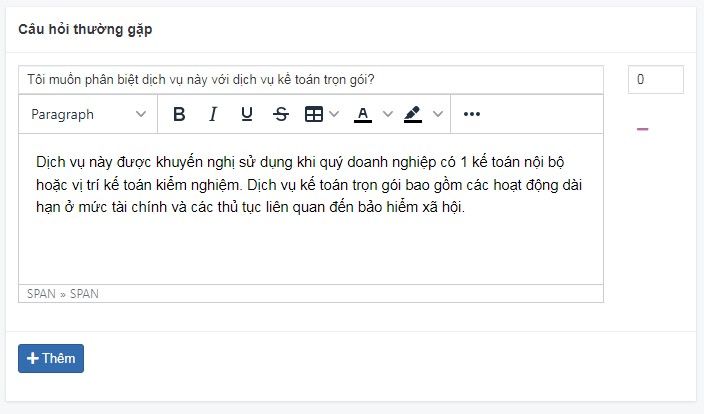
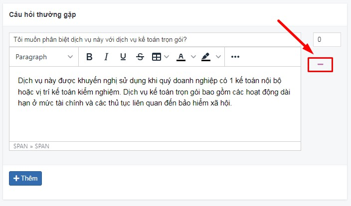
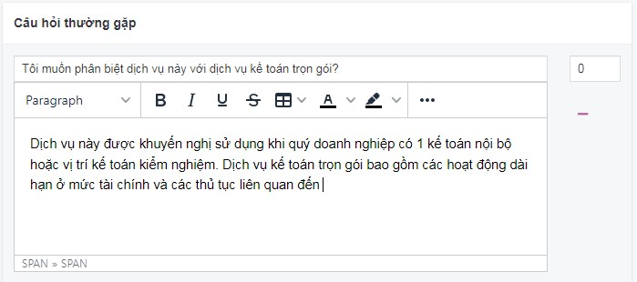
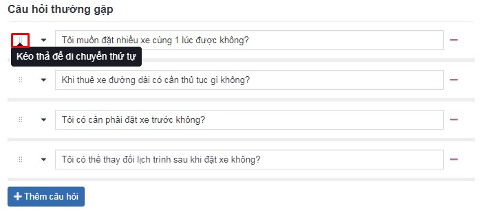

# Câu hỏi thường gặp

Tính năng này được biết đến nhiều vì lợi ích SEO, được xuất hiện trong tin bài, bài dịch vụ,...

## Thêm mới câu hỏi thường gặp

Tại trường "Câu hỏi thường gặp" trong từng vùng chức năng, bạn có thể bấm nút **Thêm câu hỏi**

**Câu hỏi**

Dựa vào mục đích của bài viết để đặt câu hỏi.

**Nội dung**

Câu trả lời cần ngắn gọn, bám sát vào câu hỏi của chủ đề. Khi bạn bôi đen câu trả lời sẽ hiển thị trình soạn thảo dạng inline (bao gồm thẻ bôi đậm, in nghiêng, trích đoạn văn và liên kết).

Sau khi xóa nội dung câu trả lời, hiển thị nhãn Undo (thực hiện để đảo ngược hành động của một hành động trước đó) và Redo (tính năng được cung cấp sau khi bạn thực hiện Undo)

## Xóa câu hỏi thường gặp

Để xóa 1 câu hỏi thường gặp, nhấn chọn nút **-** tại câu hỏi tương ứng

## Sửa câu hỏi thường gặp

Để sửa câu hỏi thường gặp, bạn thay đổi trực tiếp nội dung vào vùng nhập văn bản

Sau khi hoàn tất các thao tác thay đổi thông tin, bạn cần chọn nút **Lưu** để cập nhật những thay đổi.

## Sắp xếp lại vị trí bằng drag and drop

Tính năng này cho phép người dùng có thể di chuyển các đối tượng từ vị trí này sang vị trí khác với thao tác di 
chuột đến vị trí góc trái của câu hỏi sẽ hiển thị text `Kéo thả để di chuyển thứ tự`, sau đó di chuyển kéo thả vào vị trí mong muốn.

