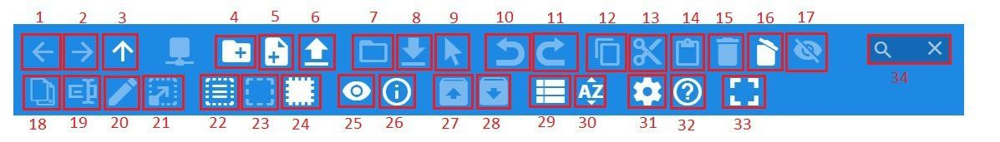
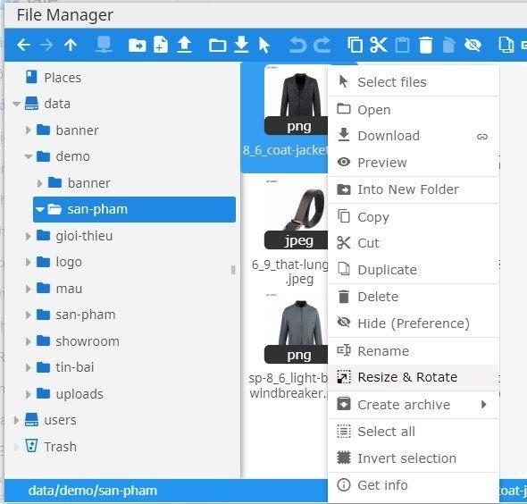
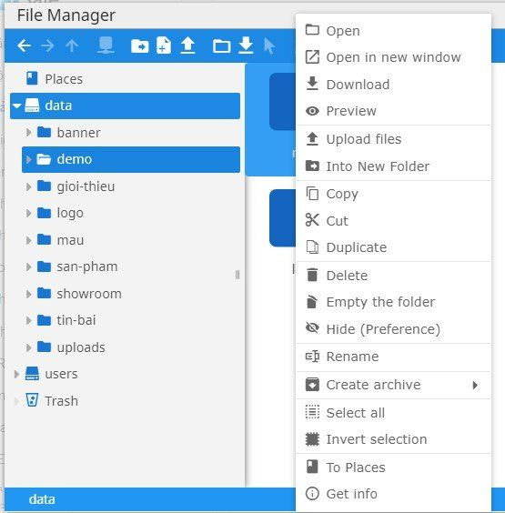
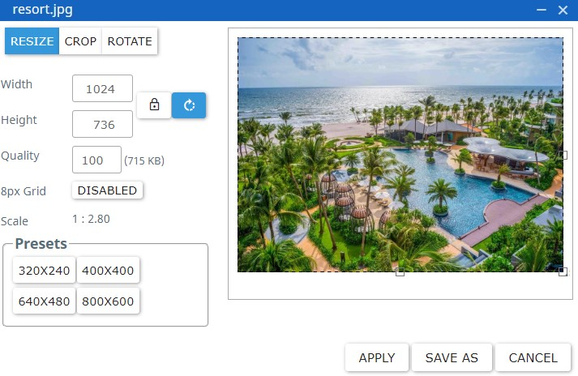

# Trình quản lý file (Finder)
Trình quản lý file (chủ yếu là hình ảnh) trên hệ thống được mô phỏng theo giao diện của Finder (trên MacOS X) và Windows Explorer với mong muốn giúp người đọc tổ chức hình ảnh hiệu quả hơn.

Hình ảnh, theo quan điểm của marketer chuyên nghiệp, chiếm 70% cảm tình của người xem. Thói quen quản lý hình ảnh khoa học sẽ đồng thời giúp bạn tiết kiệm thời gian đưa thông tin lên website và quan trọng hơn là nhận thức của bạn về giá trị của hình ảnh trong tin bài được đưa lên website.

## Những tính năng cơ bản

*   (1) Quay lại thư mục đã từng truy cập (lùi 1 bước)
*   (2) Trở về thư mục đã từng truy cập (tiến 1 bước)
*   (3) Chuyển lên thư mục trên 1 cấp
*   (4) Tạo thư mục ảnh mới
*   (5) Tạo file mới
*   (6) Upload file ảnh (chức năng người dùng hay sử dụng)
*   (7) Mở file ảnh
*   (8) Download ảnh
*   (9) Chọn file ảnh
*   (10) Bỏ qua thao tác trước đó
*   (11) Khôi phục thao tác đã bỏ qua
*   (12) Sao chép file ảnh hoặc thư mục ảnh vào khay nhớ và có thể thao tác tới thư mục đích để dán 1 tương tự.
*   (13) Cắt file ảnh hiện tại vào khay nhớ để di chuyển sang thư mục ảnh khác
*   (14) Dán ảnh vừa cắt hoặc copy vào thư mục ảnh
*   (15) Chọn ảnh cần xóa và click biểu tượng thùng rác, nút 15
*   (16) Làm trống thư mục
*   (17) Tính năng xem trước hình ảnh
*   (18) Nhân bản file ảnh hoặc thư mục ảnh
*   (19) Đổi tên ảnh hoặc thư mục ảnh
*   (20) Sửa file ảnh
*   (21) Chỉnh sửa hình ảnh trực tiếp trên giao diện Finder
*   (22) Chọn tất cả ảnh trong thư mục
*   (23) Bỏ chọn tất cả ảnh trong thư mục
*   (24) Đảo chọn toàn bộ các file trong 1 thư mục so với những file đang ở trạng thái chọn
*   (25) Tính năng xem trước hình ảnh
*   (26) Xem chi tiết kích thước file ảnh
*   (27) Giải nén tệp từ kho lưu trữ
*   (28) Tạo khi lưu trữ file ảnh
*   (29) Đổi danh sách kiểu xem thư mục ảnh hoặc file ảnh
*   (30) Sắp xếp theo thứ tự theo tên ảnh, kích thước ảnh, ngày upload ảnh
*   (34) Tìm kiếm ảnh

## Trình đơn ngữ cảnh

Trình đơn này được hiện ra khi bạn click phải chuột vào đối tượng cần thao tác. Mỗi loại đối tượng sẽ có chức năng tương ứng như dưới đây:

### Đối với file thông thường

**Các chức năng có cách sử dụng cụ thể như sau:**

*   **Open:** chức năng sẽ mở hình ảnh ra trong cửa sổ mới
*   **Download:** tải file về máy
*   **Preview:** Tính năng xem trước hình ảnh
*   **Into New Folder:** chuyển nhanh 1 file vào thư mục mới có tên NewFolder
*   **Copy:** sao chép file hiện tại vào khay nhớ và có thể thao tác tới thư mục đích để dán 1 tương tự.
*   **Cut:** cắt file hiện tại vào khay nhớ để di chuyển sang thư mục ảnh khác
*   **Duplicate:** nhân bản 1 file
*   **Delete:** xóa 1 file
*   **Hide (preference):** Ẩn file ảnh
*   **Rename:** đổi tên 1 file
*   **Resize & Rotate:** tiện ích chỉnh sửa ảnh dạng đơn giản. Xin vui lòng xem thêm cách dùng bên dưới.
*   **Create archive:** Tạo kho lưu trữ (có 5 kiểu nén: TAR archive, GZIP archive, BZIP archive, XZ archive, ZIP archive)
*   **Select all:** chọn toàn bộ file trong 1 thư mục
*   **Invert selection:** đảo chọn toàn bộ các file trong 1 thư mục so với những file đang ở trạng thái chọn

### Đối với file nén (chức năng giới hạn)

Hệ thống cho phép nén và giải nén định dạng zip trên trình quản lý file. Tuy nhiên, có 1 bất cập về sự chiếm dụng tài nguyên   
máy chủ, chức năng này chỉ được mở khi được yêu cầu hỗ trợ. Số lần mở phụ thuộc vào gói đăng ký sử dụng.

### Đối với thư mục

Cách thao tác tương tự như với file, đặc thù của thư mục sẽ cho phép bạn thao tác những chức năng sau:

*   **Open:** mở thư mục
*   **Open in new window:** mở thư mục tại cửa sổ mới
*   **Download:** tải toàn bộ nội dung thư mục về máy tính
*   **Preview:**xem trước thư mục file
*   **Upload files** upload file từ máy tính lên thư mục ảnh
*   **Into New Folder:** chuyển nhanh 1 thư mục vào thư mục mới có tên NewFolder
*   **Copy:** sao chép thư mục hiện tại vào khay nhớ và có thể thao tác tới thư mục đích để dán 1 tương tự.
*   **Cut:** cắt thư mục hiện tại vào khay nhớ để di chuyển sang 1 thư mục ảnh khác
*   **Duplicate:** nhân bản 1 thư mục
*   **Delete:** xóa thư mục ảnh
*   **Empty the folder:** xóa toàn bộ file và thư mục bên trong thư mục đang chọn
*   **Hide (Preference):** ẩn 1 thư mục 
*   **Rename:** đổi tên 1 thư mục
*   **Create archive** Tạo kho lưu trữ thư mục (có 5 kiểu nén: TAR archive, GZIP archive, BZIP archive, XZ archive, ZIP archive)
*   **Select all:** chọn toàn bộ file trong 1 thư mục
*   **Invert selection:** đảo chọn toàn bộ các file trong 1 thư mục so với những file đang ở trạng thái chọn

## Chỉnh sửa và thay đổi kích thước hình ảnh

**Các chức năng chỉ hỗ trợ mức đơn giản như dưới đây**

*   **Width:** thay đổi chiều rộng ảnh
*   **Height:** thay đổi chiều cao ảnh
*   **Aspect Ratio:** giữ tỉ lệ ảnh, điều chỉnh kích thước chiều rộng của ảnh sau đó click nút Aspect ratio thì chiều cao tự động resize theo kích thước tương ứng. Nên dùng chức năng này để ảnh theo tỉ lệ chuẩn
*   **Reset:** trở về trạng thái ban đầu của ảnh
*   **Quality:** dung lượng ảnh
*   **Scale:** tỉ lệ ảnh theo kích thước của ảnh ban đầu.
*   **Apply:** lưu đè lên ảnh gốc
*   **Save as:** lưu ảnh thành 1 file ảnh khác và ảnh gốc được giữ nguyên
*   **Crop:** cắt ảnh theo kích thích tùy chỉnh
*   **Rotate:** tùy chỉnh xoay ảnh
*   **Presets:** kích thước ảnh được cài đặt sẵn
*   **Cancel:** thoát khỏi chức năng resize

## Tư vấn tổ chức thư mục khoa học

:::caution
Có 2 lý do chính mà bạn cần tổ chức thư mục khoa học theo nhu cầu sử dụng đặc thù của từng doanh nghiệp/tổ chức.
:::
### Vì thói quen tổ chức thư mục tốt sẽ giúp bạn xử lý công việc nhanh hơn.

Hệ thống của OSD.VN theo logic tinh gọn và giảm chi phí xử lý về phần cứng máy chủ nên sẽ lưu trực tiếp thư mục và file của bạn trên ổ cứng máy chủ tương tự như cách bạn lưu thư mục và file trên Windows **Explorer** hay MacOS X **Finder**

*   Khi tìm kiếm lại ảnh đã có trên hệ thống mất thời gian hơn.
*   Mỗi lần thao tác với trình quản lý file, khi có quá nhiều file trong 1 thư mục sẽ khiến bạn phải đợi hệ thống load lại trong thời gian dài mới có thể chọn được file mong muốn

### Dễ phối hợp nhóm hơn

Điều đáng nói nhất trong việc tổ chức thư mục khoa học sẽ làm cho website của bạn truy cập nhanh hơn với người dùng. Đây là vấn đề tương đối giải thích về kỹ thuật máy tính, thậm chí cả với những chuyên gia về tin học, I/O tốc độ quay của ổ cứng máy chủ.

Trong quy mô website, người đọc quan tâm nhất đến thông tin, cách sử dụng phải đơn giản và tốc độ truy cập phải nhanh.

Khi bạn không thực hiện theo tư vấn của OSD.VN, theo thời gian, có thể phải xử lý kỹ thuật để giúp website được hoạt động nhanh:

**1\. TTFB:** chỉ số quan trọng hàng đầu để Google đo điểm SEO Onpage của website tại công cụ tư vấn Google PageSpeed Insights

**2\. Dùng CDN:** Khi hệ thống quá nhiều ảnh trong 1 thư mục vì phải load nhiều ảnh từ trang chủ sẽ cần thuê ngoài 1 giải pháp CDN nhằm giảm tải cho máy chủ.

## Cấu trúc thư mục tổng thể của toàn hệ thống

### Thư mục dành cho nhóm Quản trị

Hệ thống phân cấp thư mục linh hoạt nhằm đáp ứng đồng thời quy mô của doanh nghiệp lớn lẫn doanh nghiệp nhỏ. Khi doanh nghiệp của bạn chỉ có 1-2 người duy nhất tham gia quản lý website thì mọi ảnh được đưa lên thư mục data

### Thư mục của nhóm "Thành viên"

Thành viên trong ngữ cảnh này là người dùng KHÔNG có quyền quản trị website. Với những người sử dụng trong nhóm thành viên hệ thống tự động tạo 1 thư mục riêng biệt.

Người sử dụng trong nhóm thành viên sẽ không có quyền nhìn thấy và thao tác với nhóm khác.

Người dùng quản trị hệ thống sẽ nhìn thấy và thao tác được mọi thư mục của toàn bộ thành viên.

### Thùng rác (Trash)

Chức năng này chỉ được hiển thị với nhóm quản trị hệ thống, đề phòng sai sót trong quá trình vận hành. Ở phía cuối của bộ quản lý file có thư mục **Trash**. Tạm hiểu, đây là thư mục đệm để giảm rủi ro trong quá trình vận hành. Khi ảnh bị xóa bởi bất kỳ nhóm người dùng nào cũng sẽ được đưa vào **Trash**.

Người dùng có quyền quản trị có thể xóa vĩnh viễn hoặc khôi phục lại hình ảnh trong thùng rác, tương tự như cơ chế quản lý file với công cụ **Windows Explorer** hoặc **Finder** của **MacOS** **X**.