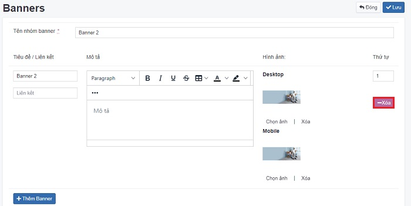
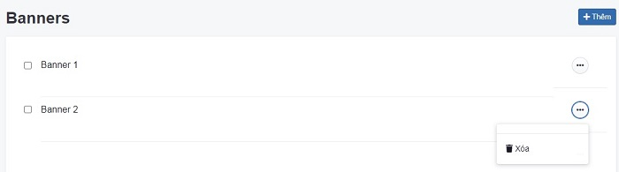
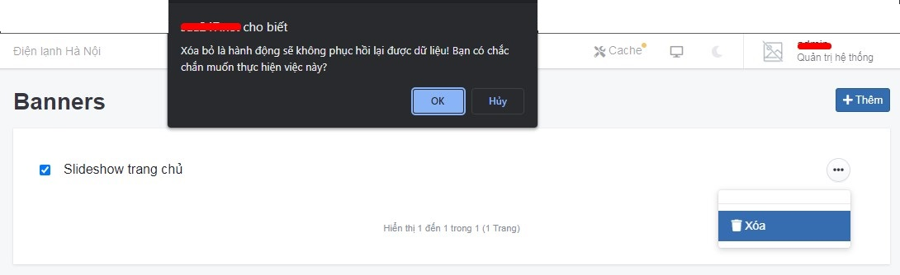

# Banner và trình diễn banner

Là công cụ trình chiếu gồm 1 chuỗi những hình ảnh.

**Một số lưu ý về slideshow và banner**

Đối với website có slideshow, bạn cần cấu hình tại **Giao diện => Mô đun => Trình diễn => Cấu hình**, tại đây bạn có thể tùy chỉnh được _kích thước desktop, kích thước mobile, kiểu chuyển động, thời gian nghỉ (ms), tốc độ trình diễn (ms) (đơn vị tính là mili giây, 1000 mili giây = 1 giây)_

Với banner muốn trình bày nhiều kiểu bố cục khác nhau, bạn có thể cấu hình tại **Giao diện => Mô đun => Trình diễn => Banner**

## Quản lý Banner

### Thêm mới banner

_Tại đây bạn có thể quản lý các banner đã tạo._

Để thêm một nhóm sản phẩm, bạn cần:

Nhấn chọn **Giao diện -> Banner -> Thêm**. Những thông tin cụ thể cần điền như sau:

**Tên nhóm banner**

Nhập tên banner tương ứng để quản lý nhóm banner theo logic

**Trạng thái**

Lựa chọn trạng thái hiển thị banner (Bật: cho phép hiển thị/Tắt: không cho phép hiển thị)

**Tiêu đề**

Nhập tên tiêu đề mỗi banner muốn hiển thị trên ảnh banner đó

**Link**

Dán liên kết tại đây. Khi xem ngoài website và click vào ảnh hệ thống sẽ chuyển hướng tới liên kết này.

**Mô tả**

Nội dung mô tả ngắn gọn, cung cấp đầy đủ thông tin hữu ích, tạo niềm tin cho người đọc.

**Desktop**

Upload ảnh banner theo kích thước desktop

**Mobile**

Upload ảnh banner theo kích thước mobile

Xem thêm cách upload ảnh [tại đây](https://mkmate.osd.vn/docs/common/finder)

**Thứ tự**

Xem thêm [tại đây](https://mkmate.osd.vn/docs/common/logic)

**Thêm banner**

Nhấn chọn để thêm nhiều banner khác nhau

Nhấp chuột vào nút **Lưu** để hoàn tất.

### Xóa một nhóm banner

Để xóa một ảnh trong nhóm banner, nhấn nút **Xóa** ảnh tại ảnh banner đó.

Để xóa toàn bộ một ảnh, nội dung và liên kết của banner trong nhóm banner, nhấn nút **Xóa** tại ảnh banner đó.

Hoặc ddể xóa một nhóm banner, nhấp chuột vào nút 3 chấm cuối nhóm banner và chọn nút **Xóa**.

Hệ thống hiển thị popup **Xóa** bỏ là hành động sẽ không phục hồi lại được dữ liệu! Bạn có chắc chắn muốn thực hiện việc này?. Chọn **Ok**

### Sửa một nhóm banner

Để thay đổi thông tin các trường trong nhóm banner, bạn chọn nhấn chọn trực tiếp tại nhóm banner.

Để sửa một ảnh trong nhóm banner, nhấn **Chọn ảnh** để tải lại ảnh tại nhóm banner đó

Sau khi thay đổi các thông tin nội dung của banner bạn cần chọn **Lưu** để hoàn tất.

## Cấu hình trình diễn

### Thêm mới cấu hình trình diễn

Nhấn chọn **Giao diện -> Mô đun -> Trình diễn -> Cấu hình**

Tại đây bạn có thể thiết lập cấu hình mô đun. Những thông tin cụ thể cần điền như sau:

**Bố cục**

Lựa chọn bố cục hiển thị tại danh sách thả xuống

**Vị trí**

Lựa chọn vị trí hiển thị tại danh sách thả xuống

**Thứ tự**

Xem thêm [tại đây](https://mkmate.osd.vn/docs/common/logic)

**Trạng thái**

Lựa chọn trạng thái hiển thị mô đun (Bật: cho phép hiển thị/Tắt: không cho phép hiển thị)

**Banner**

Lựa chọn nhóm banner hiển thị trên bố cục/vị trí của website. Nhóm banner bạn đã tạo tại **Giao diện => Banner**

**Kích thước desktop**

Nhập kích thước chiều rộng và chiều cao cho slideshow trên bản desktop

**Kích thước mobile**

Nhập kích thước chiều rộng và chiều cao cho slideshow trên bản mobile

**Kiểu chuyển động**

Có 3 kiểu chuyển động là Fade, Slide, Loop

**Thời gian nghỉ (ms)**

Nhập thời gian nghỉ cho mỗi slide (đơn vị tính là mili giây, 1000 mili giây = 1 giây)

**Tốc độ trình diễn (ms)**

Nhập tốc độ trình diễn chuyển động mỗi slide (_đơn vị tính là mili giây, 1000 mili giây = 1 giây_)

**Thêm mô-đun**

Chọn thêm mô đun để hiển thị giao diện bố cục khác nhau.

_Chú ý: cần nhập thông tin tất cả các trường tại mô đun_

### Xóa cấu hình trình diễn

Nhấn chọn **Xóa** để xóa mô đun này, hệ thống sẽ xác nhận với nội dung như sau: **"Bạn có chắc chắn muốn xóa đối tượng này không? Đây là hành động sẽ không thể khôi phục lại được."**. 

Bạn chọn **Ok** nếu xác nhận xóa.

### Sửa cấu hình trình diễn

Để sửa cấu hình, bạn cần nhấn chọn **Giao diện -> Mô đun -> Trình diễn -> Cấu hình**.

Sau khi thay đổi các thông tin - thiết lập của mô đun cần chọn **Lưu** để hoàn tất.
