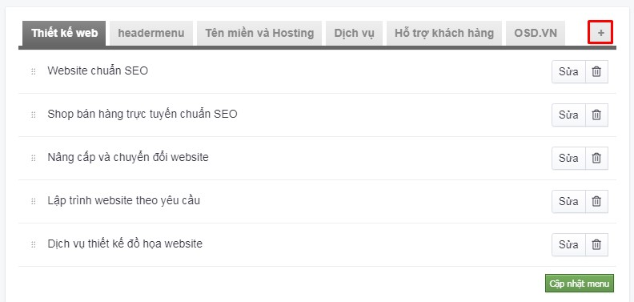
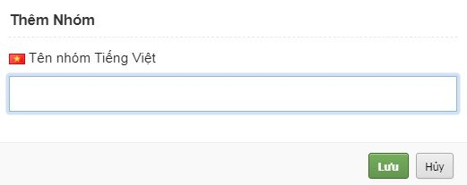
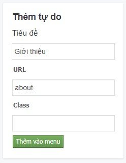
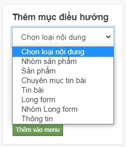
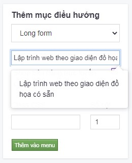
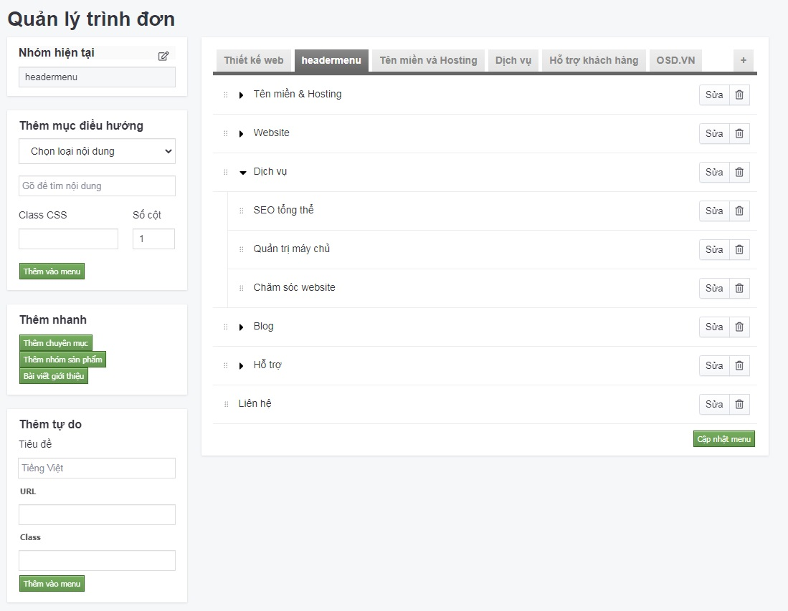
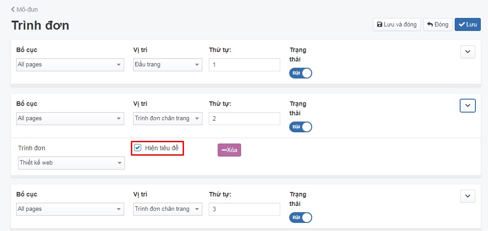
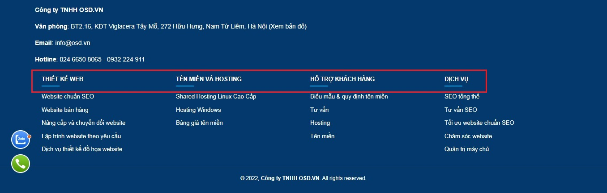

# Trình đơn & trình bày trình đơn

Top Menu là các mục trình đơn thường nằm ở phần đầu của trang web. Top Menu sẽ giúp mọi người thuận thiện trong việc truy cập nhanh vào các chuyên mục khác nhau trên trang web của bạn.

## Quản lý trình đơn

### Thêm trình đơn

Nhấn chọn **Giao diện -> Trình đơn**

Để tạo nhóm trình đơn, bạn chọn nút **(+)** bên góc màn hình phải

Những thông tin cụ thể cần điền như sau

**Tên nhóm Tiếng Việt**

Nhập tên nhóm trình đơn bằng tiếng Việt

Nhấn nút **Lưu** để hoàn tất

### Thêm trình đơn tự do

Để thêm trình đơn tự do, bạn điền thông tin tại trường **Thêm tự do**

Những thông tin cụ thể cần điền như sau

**Tiêu đề Tiếng Việt**

Nhập tiêu đề trình đơn bằng tiếng Việt

**URL**

Khi tạo trình đơn bạn nên tạo thêm liên kết trên các trình đơn của trang để người dùng có thể xem những nội dung của bạn. Liên kết URL được trùng với URL nhóm sản phẩm hoặc URL nhóm tin tức hoặc URL bài cụ thể trong website 

Khi hoàn thành nhấn chọn **Thêm vào menu** để hoàn tất

### Thêm mục điều hướng
Thêm nhanh trình đơn bằng thao tác thêm mục điều hướng như sau:

Tại trường **Thêm mục điều hướng**, bạn nhấn chọn danh sách thả xuống để chọn loại nội dung tương ứng cần thêm trình đơn trên wesbite

Ví dụ: nhấn chọn **nhóm Long Form** hoặc nhóm bất kỳ => Gõ tên nhóm longform, hệ thống sẽ gợi ý cho bạn chọn

Sau khi chọn xong nhóm longform, các trình đơn sẽ được hiển thị như sau

Tiếp theo, bạn cần nhấn chọn **Thêm vào menu**, các trình đơn sẽ được chuyển sang màn hình bên phải, hình minh họa dưới đây, sau đó nhấn chọn **Cập nhật menu**

**Cấu hình trình đơn cấp con** Nhấn và giữ menu cần tùy chỉnh cấp con và kéo, thả khoảng 1cm sau đó click **Cập nhật menu** để lưu lại vị trí thứ tự của trình đơn. Xem chi tiết hình bên dưới.

Làm tương tự đối với các cấp trình đơn nhỏ hơn

Nhóm Footermenu hoặc các nhóm khác làm tương tự Topmenu. Có thể tạo nhiều nhóm menu để cấu hình tại nhiều bố cục/vị trí khác nhau.

### Xóa trình đơn

Bạn nhấn chọn nút **Delete** (icon hình thùng rác) bên cạnh **Sửa**. Chọn **OK**.

Hệ thống cảnh báo bạn chắc chắn muốn xóa với nội dung như sau: "Xóa mục trình đơn Bạn có chắc chắn muốn xóa mục trình đơn này? **ten_trinh_don**. Việc này đồng thời cũng sẽ xóa các mục cấp dưới nếu có." Chọn **Đồng ý** nếu chắc chắn xóa.

Sau khi thay đổi các thông tin - thiết lập của trình đơn, cần chọn **Lưu**, tiếp theo chọn **Cập nhật menu** để lưu lại những thay đổi.

### Sửa trình đơn

Nhấn chọn nút sửa tại trình đơn muốn sửa. Sau khi thay đổi thông tin trình đơn, bạn cần chọn **Lưu** để cập nhật.

## Cấu hình trình đơn

### Thêm mới cấu hình trình đơn

Nhấn chọn **Giao diện -> Mô-đun -> Trình đơn -> Cấu hình**

Những thông tin cụ thể cần điền như sau

**Bố cục**

Lựa chọn bố cục hiển thị tại danh sách thả xuống

**Vị trí**

Lựa chọn vị trí hiển thị tại danh sách thả xuống

**Thứ tự**

Xem thêm [tại đây](https://mkmate.osd.vn/docs/common/logic)

**Trình đơn**

Lựa chọn nhóm menu được cấu hình tại **Giao diện -> Trình đơn** trước đó

**Trạng thái**

Lựa chọn trạng thái hiển thị cho mô đun (Bật: cho phép hiển thị/Tắt: không cho phép hiển thị)

Tích vào ô check box để hiển thị tên nhóm menu trên bố cục/vị trí của website

Hình minh họa cấu hình như dưới đây:

	

Hiển thị bên ngoài website như dưới đây

Sau khi thay đổi các thông tin - thiết lập của mô đun cần chọn **Lưu** để hoàn tất.

### Xóa cấu hình trình đơn
Để xóa cấu hình trình đơn, nhấn chọn nút **Xóa** tại mô đun trình đơn đó.

Hệ thống sẽ xác nhận với nội dung như sau: **Bạn có chắc chắn muốn xóa đối tượng này không? Đây là hành động sẽ không thể khôi phục lại được.**

Bạn chọn **Ok** nếu xác nhận xóa.

### Sửa cấu hình trình đơn
Để sửa cấu hình trình đơn, nhấn chọn **Giao diện -> Mô-đun -> Trình đơn -> Cấu hình**.

Sau khi thay đổi các thông tin - thiết lập của mô đun cần chọn **Lưu** để hoàn tất.
