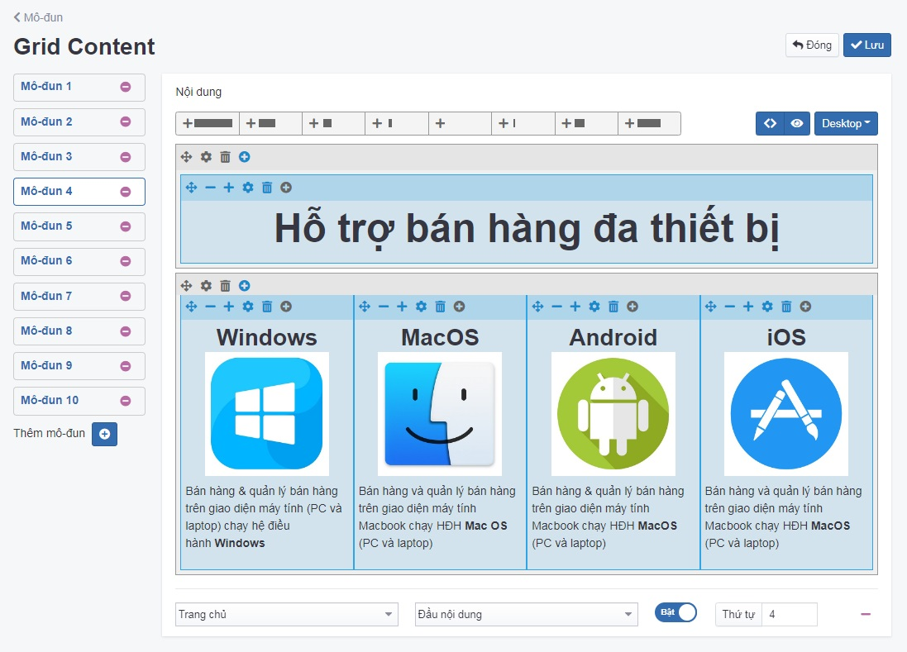
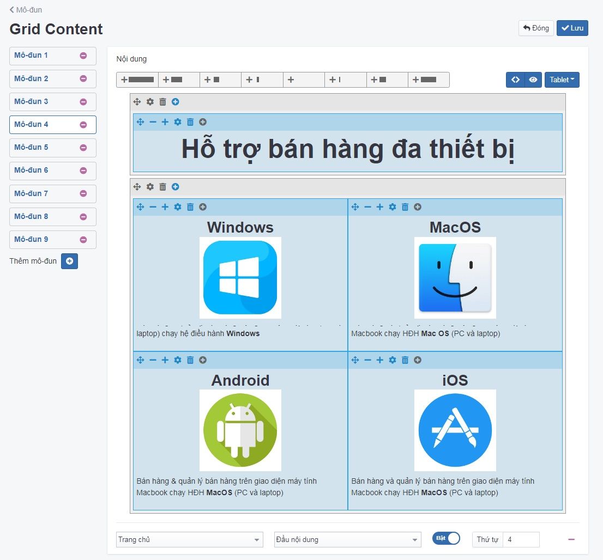
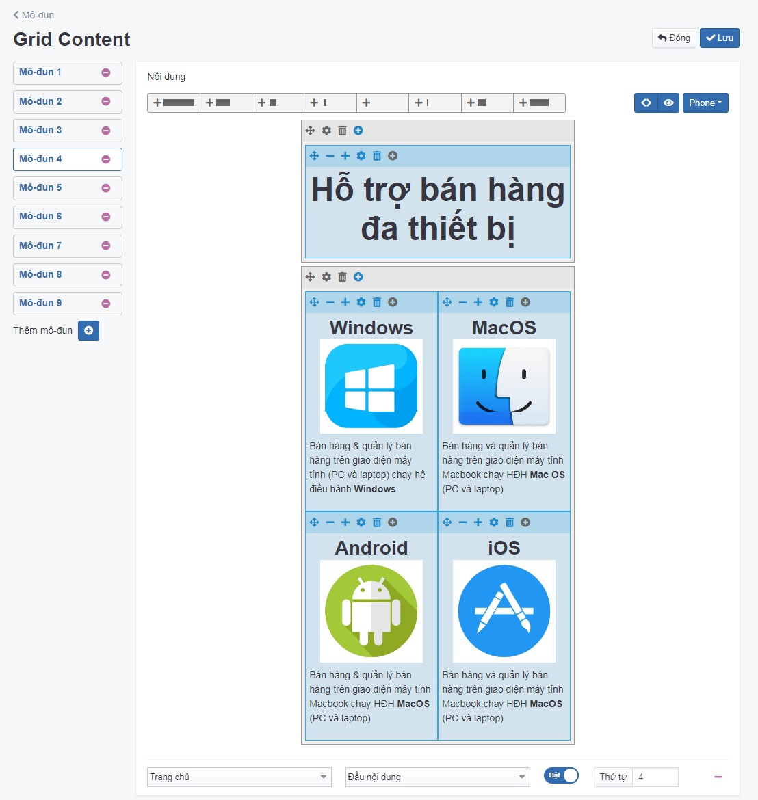

# Mô đun Grid Content

Chức năng này dùng để trình bày những loại nội dung có nhiều cột phức tạp và quan trọng là trên mobile và desktop được trình bày khác nhau

## Thêm mới mô đun Grid Content

Để cấu hình mô đun Grid Content, bạn cần:

Tại màn hình quản trị, bạn chọn mục **Giao diện -> Mô đun -> Grid Content -> Cấu hình -> Thêm mô đun**

Trang tạo cấu hình mô đun **Grid Content** được mở ra, điền và cấu hình các thông tin chi tiết của mô đun đó.

Tùy chỉnh màn hình Desktop:

Tùy chỉnh màn hình Tablet:

Tùy chỉnh màn hình Mobile:

**Nội dung**

Mô tả chi tiết bài thông tin muốn hiển thị để người dùng hiểu rõ hơn về lĩnh vực của bạn đang kinh doanh. Có 8 loại tab nội dung theo 8 cách hiển thị khác nhau như sau:

- Add row 12
- Add row 6-6
- Add row 4-4-4
- Add row 3-3-3-3
- Add row 2-2-2-2-2-2
- Add row 2-8-2
- Add row 4-8
- Add row 8-4

Hình minh họa mỗi tab được hiển thị lần lượt như sau:

**Preview**

Xem trước khi xuất bản nội dung

**Edit Source Code**

Nhấn chọn để chỉnh sửa mã HTML của bài viết

**Desktop, Tablet, Mobile**

Tùy chỉnh theo 3 phiên bản. Bạn cần nhấn vào danh sách thả xuống và chọn phiên bản **Desktop, Tablet, Mobile** tương ứng, sau đó nhấn chọn dấu cộng tại mỗi hàng để tùy chỉnh kích thước mỗi box tương ứng hiển thị trên màn hình.

**Bố cục/Vị trí**

Xem thêm [tại đây](https://pisale.osd.vn/docs/common/logic#b%E1%BB%91-c%E1%BB%A5c-v%C3%A0-v%E1%BB%8B-tr%C3%AD)

**Trạng thái**

Xem thêm [tại đây](https://pisale.osd.vn/docs/common/logic/#tr%E1%BA%A1ng-th%C3%A1i-v%C3%A0-xu%E1%BA%A5t-b%E1%BA%A3n)

**Thứ tự**

Xem thêm [tại đây](https://pisale.osd.vn/docs/common/logic#th%E1%BB%A9-t%E1%BB%B1-s%E1%BA%AFp-x%E1%BA%BFp-l%C3%A0-s%E1%BB%91-ch%E1%BB%89-%C4%91%E1%BB%8Bnh)

Nhấn chọn **Lưu** để hoàn tất.

### Xóa mô đun Grid Content

Nhấn chọn **Xóa** để xóa mô đun này.

Xem thêm [tại đây](https://pisale.osd.vn/docs/common/logic#x%C3%B3a-c%C3%A1c-m%E1%BB%A5c-c%C3%A1c-th%C3%A0nh-ph%E1%BA%A7n-th%C3%B4ng-tin)

### Sửa mô đun Grid Content

Để sửa cấu hình, bạn cần nhấn chọn **Giao diện -> Mô đun -> Grid Content -> Cấu hình**.

Sau khi thay đổi các thông tin - thiết lập của mô đun cần chọn **Lưu** để hoàn tất.
