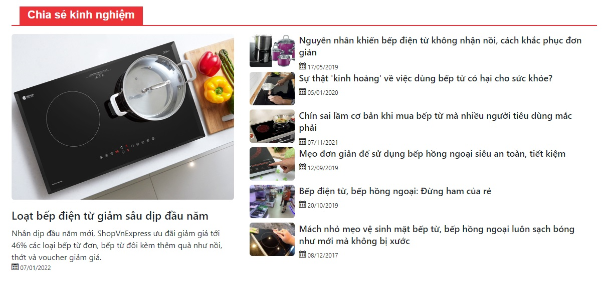
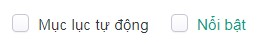

# Mô đun trình bày tin bài

Cho phép cấu hình mô đun trình bày tin bài tại nhiều bố cục và vị trí khác nhau trên website.

## Thêm cấu hình trình bày tin bài

Để cấu hình mô đun trình bày tin bài, bạn cần:

Nhấn chọn **Giao diện -> Mô đun -> Trình bày dịch vụ -> Cấu hình -> Thêm mô đun**. Những thông tin cụ thể cần điền như sau:

**Bố cục/Vị trí**

Xem thêm [tại đây](https://pisale.osd.vn/docs/common/logic#b%E1%BB%91-c%E1%BB%A5c-v%C3%A0-v%E1%BB%8B-tr%C3%AD)

**Trạng thái**

Xem thêm [tại đây](https://pisale.osd.vn/docs/common/logic/#tr%E1%BA%A1ng-th%C3%A1i-v%C3%A0-xu%E1%BA%A5t-b%E1%BA%A3n)

**Thứ tự**

Xem thêm [tại đây](https://pisale.osd.vn/docs/common/logic#th%E1%BB%A9-t%E1%BB%B1-s%E1%BA%AFp-x%E1%BA%BFp-l%C3%A0-s%E1%BB%91-ch%E1%BB%89-%C4%91%E1%BB%8Bnh)

**Hiện tiêu đề**

Lựa chọn các tùy chọn tại danh sách thả xuống

**Chuyên mục**

Lựa chọn danh mục nhóm tin bài tại danh sách thả xuống

**Mẫu trình bày**

Lựa chọn mẫu trình bày tại danh sách thả xuống

**Hiện ảnh**

Tích chọn, để hiện ảnh tại nhóm tin này

**Lượt xem**

Tích chọn, để hiển thị lượt xem tại nhóm tin này

**Sapo**

Tích chọn, để hiển thị sapo tại nhóm tin này

**Ngày đăng**

Tích chọn, để hiển thị ngày đăng tại nhóm tin này

**Giới hạn**

Nhập giới hạn số bài hiển thị

**Tin nhấn mạnh**: nhập số tin cần nhấn mạnh. Với 1 tin nhấn mạnh được hiển thị như sau:

**Khổ ảnh/Tỷ lệ/Sắp xếp theo**

Lựa chọn kiểu sắp xếp tại danh sách thả xuống

- **Lượt xem**: hiển thị sắp xếp theo lượt xem bài tin
- **Thứ tự**: hiển thị sắp xếp theo thứ tự của mỗi bài tin
- **Nổi bật**: hiển thị các bài tin được tích vào trường Nổi bật. (Trong mỗi bài tin bạn cần tích vào trường nổi bật để hiển thị theo sắp xếp này)

- **Ngày đăng**: hiển thị theo ngày đăng của bài tin

**Kiểu sắp xếp**

Lựa chọn kiểu sắp xếp tại danh sách thả xuống

Nhấn chọn **Lưu** để hoàn tất.

## Xóa cấu hình trình bày tin bài
Nhấn chọn **Xóa** để xóa mô đun này.

Xem thêm [tại đây](https://pisale.osd.vn/docs/common/logic#x%C3%B3a-c%C3%A1c-m%E1%BB%A5c-c%C3%A1c-th%C3%A0nh-ph%E1%BA%A7n-th%C3%B4ng-tin)

## Sửa cấu hình trình bày tin bài

Để sửa cấu hình, bạn cần nhấn chọn **Giao diện -> Mô đun -> Trình bày tin bài -> Cấu hình**.

Sau khi thay đổi các thông tin - thiết lập của mô đun cần chọn **Lưu** để hoàn tất.
