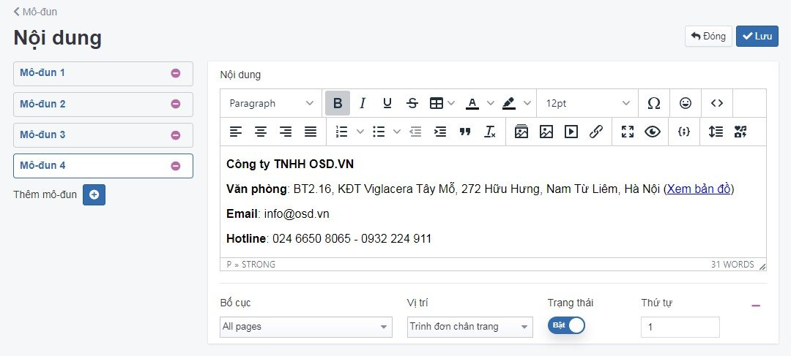

# Mô đun Nội dung

Cho phép hiển thị các thông điệp tùy chỉnh trên website.

## Thêm mới mô đun Nội dung

Để cấu hình mô đun Nội dung, bạn cần:

Nhấn chọn **Giao diện -> Mô đun -> Nội dung -> Cấu hình -> Thêm mô đun**

Trang tạo cấu hình mô đun Nội dung được mở ra, điền và cấu hình các thông tin chi tiết của danh mục đó.

Những thông tin cần cấu hình như sau:

**Nội dung**

Nhập thông tin cần hiển thị ví dụ như địa chỉ website, thông điệp muốn hiển thị trên website

**Bố cục/Vị trí**

Xem thêm [tại đây](https://pisale.osd.vn/docs/common/logic#b%E1%BB%91-c%E1%BB%A5c-v%C3%A0-v%E1%BB%8B-tr%C3%AD)

**Trạng thái**

Xem thêm [tại đây](https://pisale.osd.vn/docs/common/logic/#tr%E1%BA%A1ng-th%C3%A1i-v%C3%A0-xu%E1%BA%A5t-b%E1%BA%A3n)

**Thứ tự**

Xem thêm [tại đây](https://pisale.osd.vn/docs/common/logic#th%E1%BB%A9-t%E1%BB%B1-s%E1%BA%AFp-x%E1%BA%BFp-l%C3%A0-s%E1%BB%91-ch%E1%BB%89-%C4%91%E1%BB%8Bnh)

Sau khi thay đổi các thông tin - thiết lập của mô đun cần chọn **Lưu** để hoàn tất.

### Xóa mô đun nội dung

Nhấn chọn **Xóa** để xóa mô đun này.

Xem thêm [tại đây](https://pisale.osd.vn/docs/common/logic#x%C3%B3a-c%C3%A1c-m%E1%BB%A5c-c%C3%A1c-th%C3%A0nh-ph%E1%BA%A7n-th%C3%B4ng-tin)

### Sửa mô đun nội dung

Để sửa cấu hình, bạn cần nhấn chọn **Giao diện -> Mô đun -> Nội dung -> Cấu hình**.

Sau khi thay đổi các thông tin - thiết lập của mô đun cần chọn **Lưu** để hoàn tất.
