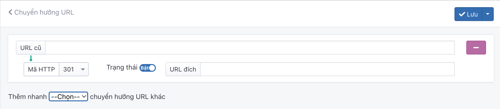

# Chuyển hướng URL (301,302 redirect)

Chuyển hướng URL là phương pháp chuyển hướng nhằm thông báo rằng các URL hoặc các trang web đã được chuyển hướng vĩnh viễn sang một URL hoặc một trang web khác. Điều này có nghĩa là tất cả các giá trị của trang web hoặc URL gốc như hình ảnh, nội dung… sẽ được chuyển hết sang URL mới.

Nhấn chọn **SEO -> Chuyển hướng URL**. Nhấn chọn nút **Thêm** để thêm mới 1 mục.

Trang tạo Redirect URL được mở ra, điền các thông tin chi tiết như sau.

Những thông tin cần cập nhật như sau:

**URL cũ**

Nhập tên URL cũ vào button, URL được xác định bị xóa khỏi website _(ví dụ: https://osd.vn/news/all)_

**URL đích**

Nhập địa chỉ URL trang đích mà bạn muốn chuyển hướng đến, thao tác này thực hiện chuyển hướng người dùng lẫn bộ máy tìm kiếm từ một đường dẫn URL qua một đường dẫn URL khác _(ví dụ: https://osd.vn/news/blog)_

**Thêm nhanh**

Phần này giúp chúng ta có thể thêm nhiều url khác nhau

Nhấn chọn nút **Lưu** để lưu thông tin.
