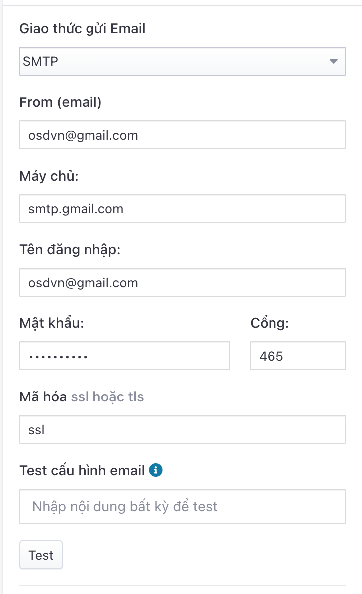

# Tích hợp giao thức gửi email
Để Pisale có thể gửi email cho người dùng, chúng ta có 2 lựa chọn như sau:

1. **Mặc định**: sử dụng dịch vụ gửi email của OSD.VN
2. **SMTP**: dịch vụ SMTP do bạn khai báo

Để thực hiện tích hợp, bạn cần vào **Hệ thống** -> **Tích hợp** -> Tab **Dịch vụ giao tiếp** -> **Giao thức email** -> Chọn **Mặc định** hoặc **SMTP**. Những lựa chọn này sẽ có ý nghĩa như sau:

## 1. Mặc định
OSD.VN trang bị hệ thống gửi email có sẵn cho toàn bộ khách hàng, tuy nhiên, với 1 số website cần gửi thông tin xác nhận với người dùng thì phần thông tin người gửi sẽ không đảm bảo tính nhận diện thương hiệu của bạn. 
Những thông tin trong phần người gửi sẽ có:
Tên người gửi: Pisale
Email người gửi: pisale@due...

## 2. Giao thức SMTP
Tình huống này bạn sẽ đảm bảo được tính nhất quán về thương hiệu, thông tin gửi email sẽ không bị lộ với người sử dụng.

Thông tin chi tiết cần điền như sau:

### 2.1. From (email)
Là địa chỉ email sẽ xuất hiện tại trường from của email gửi cho khách hàng.

### 2.2. Máy chủ
Điền tên máy chủ SMTP sẽ gửi email. Ví dụ: _smtp.gmail.com_

### 2.3. Tên đăng nhập
Điền tài khoản email dùng để đăng nhập vào máy chủ SMTP. Ví dụ: _osdvn@gmail.com_

### 2.4. Mật khẩu
Điền mật khẩu của khoản email dùng để đăng nhập vào máy chủ SMTP.

### 2.5. Cổng
Điền cổng của máy chủ SMTP. Ví dụ: 25, 465, 587,... 

### 2.6. Mã hóa (ssl hoặc tls)
Kiểu mã hóa bảo mật khi máy chủ SMTP cho phép kết nối bảo mật. Thường giá trị sẽ là **ssl** nếu phần cổng SMTP là **465** hoặc **tls** nếu máy chủ SMTP mở cổng **587**.

Trong tình huống máy chủ SMTP không hỗ trợ giao thức bảo mật, bạn sẽ để trống trường này.

### 2.7. Test (kiểm tra thông tin khai báo SMTP)
Pisale hỗ trợ bạn test xem kết nối email có chính xác không. Cách thực hiện chỉ đơn giản là điền đoạn nội dung bất kỳ vào ô "Test cấu hình email" và bấm nút **Test** -> Hệ thống sẽ gửi email kiểm tra vào địa chỉ email bạn khai báo trong phần _Hệ thống -> Thiết lập hệ thống_
