# Hướng dẫn tích hợp Google Analytics

## Tạo thuộc tính Google Analytics

Truy cập vào Google Analytics theo đường dẫn sau: [https://analytics.google.com/analytics/web](https://analytics.google.com/analytics/web)

Google yêu cầu đăng nhập vào tài khoản gmail của bạn.

Vào chức năng quản trị sau đó tạo tài khoản mới

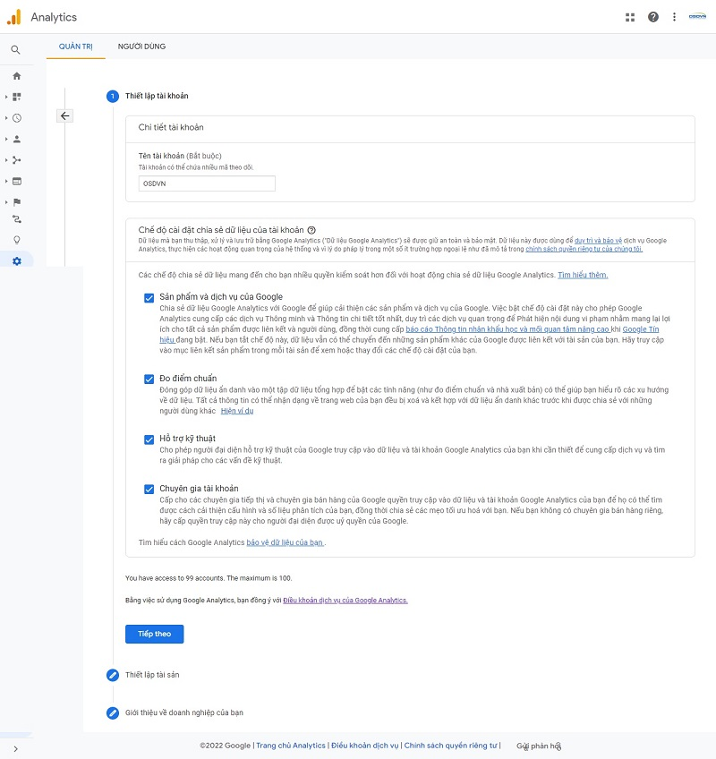

Sau khi thiết lập tài khoản xong bạn nhấn chọn nút **Tiếp theo**

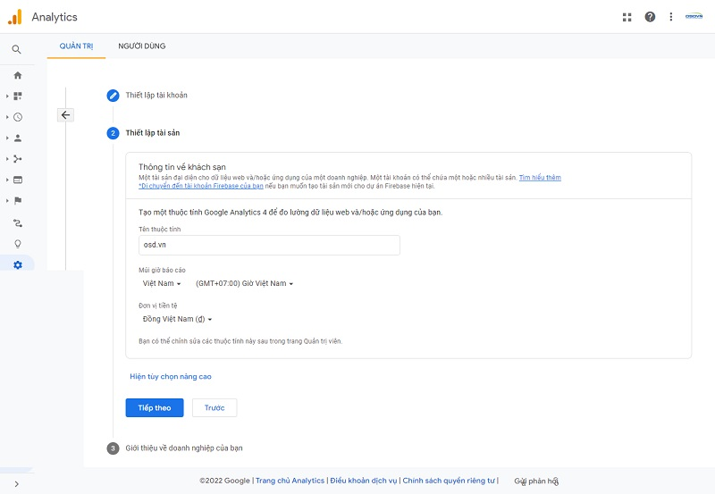

Tại màn hình thiết lập tài sản, các trường điền như sau:

- **Tên thuộc tính**: điền tên thuộc tính
- **Múi giờ báo cáo**: chọn Việt Nam
- **Đơn vị tiền tệ**: chọn Đồng Việt Nam

Nhấn chọn **Tiếp theo** được chuyển hướng đến tab **Giới thiệu về doanh nghiệp**

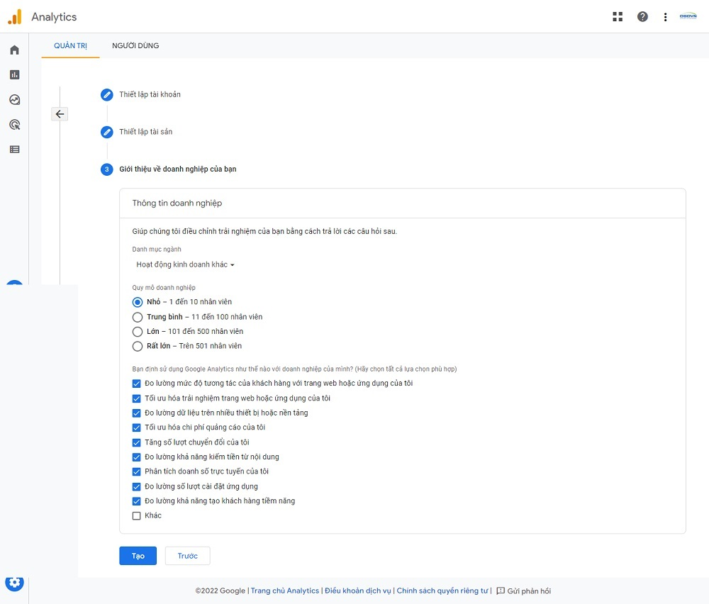

Lựa chọn thông tin phù hợp cho doanh nghiệp của bạn, nhấn chọn **Tạo** và được chuyển hướng đến điều khoản của Google

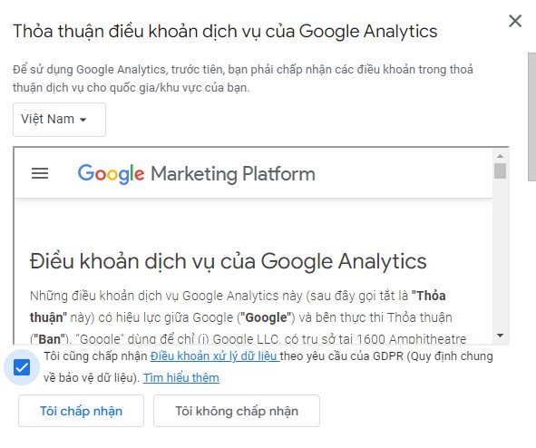

## Thiết lập tính năng đo lường trên tên miền

Tạo thành công thuộc tính và bắt đầu cấu hình thu thập dữ liệu:

Để thiết lập tính năng thu thập dữ liệu cho trang web hoặc ứng dụng của bạn, hãy chọn nguồn mà bạn muốn thu thập dữ liệu (web, ứng dụng Android hay ứng dụng iOS). Tiếp theo, bạn sẽ nhận được hướng dẫn về cách thêm thẻ thu thập dữ liệu vào nguồn đó.

Phương thức khuyên dùng là chọn nền tảng Web.

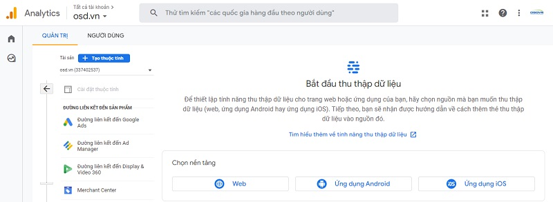

Thiết lập dữ liệu, bạn điền URL trang web và tên luồng, sau đó nhấn chọn **Tạo luồng**.

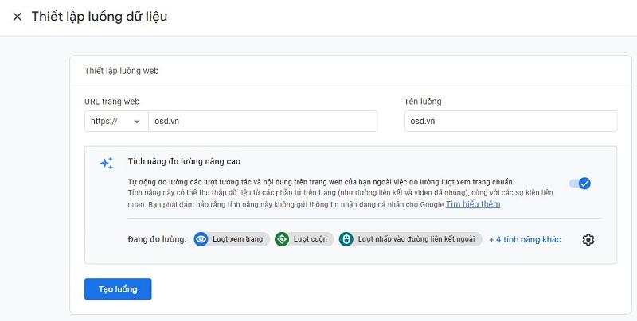

Tạo luồng thành công được chuyển hướng tới màn hình **Thông tin chi tiết về luồng phát**, tại đây Google Analytics cấp cho bạn 1 mã đo lường theo dõi.

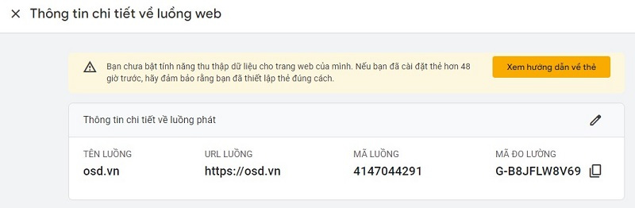

Bạn có thể sử dụng trình tạo trang web để tự động hoàn tất việc thiết lập hoặc tự cài đặt thẻ. Để đảm bảo nhận được kết quả đo lường chính xác, bạn cài đặt thẻ trên trang web bạn cần theo dõi.

**Hướng dẫn dán Mã Google Analytics trong quản trị web**

Có 2 cách tích hợp Mã Google Analytics vào quản trị web

Cách 1: Copy `Mã đo lường` và dán vào vùng `Tích hợp`

Bạn cần sao chép mã đo lường và truy cập vào quản trị web theo đường dẫn sau: **Hệ thống -> Tích hợp -> Mã Google Analytics** và dán mã vừa copy vào đây sau đó nhấn chọn nút (v) để lưu cập nhật thông tin.

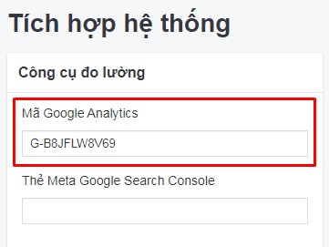

Cách 2: `Xem hướng dẫn về thẻ` và dán vào vùng `Mã nhúng`

Tại màn hình quản trị luồng dữ liệu website, nhấn chọn xem chi tiết luồng dữ liệu của website đó

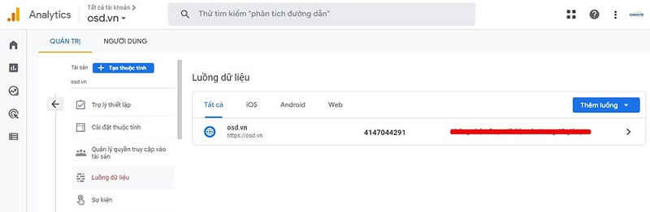

Tiếp theo, nhấn chọn **Xem hướng dẫn về thẻ**, tại đây hướng dẫn rất chi tiết, bạn copy mã thẻ và dán vào vùng **Giao diện -> Mã nhúng -> Script header**

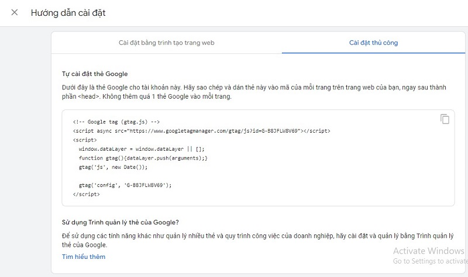

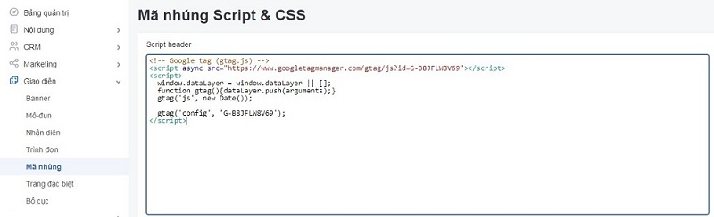

Sau khi dán thẻ vào `Mã nhúng` bạn cần nhấn chọn nút (v) để lưu cập nhật thông tin.

_Chúc bạn thành công!_
