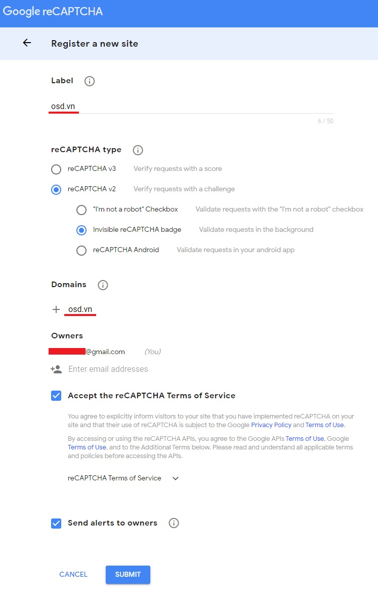
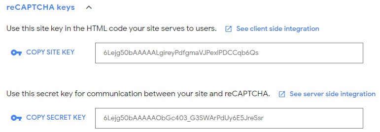
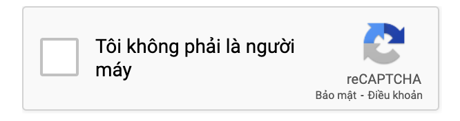

# Tích hợp Google Recaptcha

Việc tích hợp này giúp cho website tránh:
* Bị spam đăng ký..
* Tránh bị tấn công ddocs từ các form đăng kí...

Tích hợp Google Recaptcha, hệ thống đang hỗ trợ ở mức hiện hộp checkbox tại trang liên hệ.

Để tích hợp Google Recaptcha, bạn cần đăng kí Google Recaptcha phiên bản V2. Bạn có thể tìm hiểu chi tiết về Google Recaptcha phiên bản V2 tại https://developers.google.com/recaptcha/docs/display.

### Đăng kí Google Recaptcha 

#### Bước 1
Đầu tiên các bạn đăng nhập gmail, sau đó truy cập vào đường dẫn: https://www.google.com/recaptcha/admin/create

#### Bước 2
Bạn sẽ nhận được một yêu cầu đăng kí cho trang web. Tại màn hình khai báo thông tin, bạn cần điền thông tin, sau khi điền thông tin xong tiếp đến bạn cần chọn `SUBMIT`.

> **Trong đó:** 
> **Label:** tên của reCaptcha để phân biết với những reCaptcha khác.
**Domains:** những domain nào được phép sử dụng reCaptcha này. Ví dụ: tên miền osd.vn

***Lưu ý:***
* Ở phần Recaptcha type bạn sẽ chọn `reCAPTCHA v2` => Chọn `"I'm not a robot"Checkbox` 
> Giải thích: "I'm not a robot"Checkbox nghĩa là Hộp kiểm "Tôi không phải là rô bốt".

#### Bước 3
Sau đó đồng ý các điều khoản và chọn `Submit.`

#### Bước 4
Khi đăng kí thành công có 2 giá trị chúng ta cần quan tâm đó là:
* **Site key:** sử dụng reCaptcha nào trong danh sách reCaptcha của bạn.
* **Secret key:** key bảo mật để bạn kết nối với google đảm bảo cho kết nối không bị giả mạo, bạn hãy chắc chắn rằng nó sẽ không bao giờ lộ ra ngoài.

Sau đó chọn **Go to Analytics** để hoàn thành cấu hình reCapcha.

### Hướng dẫn tích hợp reCaptcha vào website

Truy cập với quyền quản trị của website, nhấn chọn **Hệ thống** => **Tích hợp** => **Google Recaptcha** => dán mã **Site key** vào trường **Site key** và, dán mã **Secret key** vào trường **Secret key** => chọn **Lưu** để hoàn tất.

***Trong đó:***
* **Site key:** khóa công khai
* **Secret key:** khóa bí mật

Sau khi tích hợp, trong form liên hệ sẽ xuất hiện 1 hộp checkbox để sau khi người dùng điền đầy đủ thông tin sẽ phải xác nhận Google Recaptcha.

