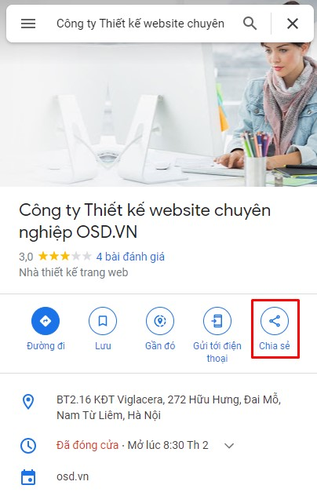
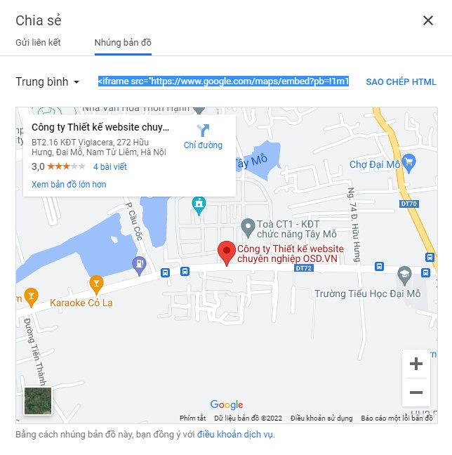
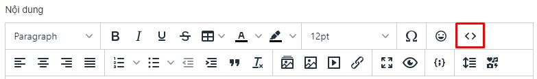
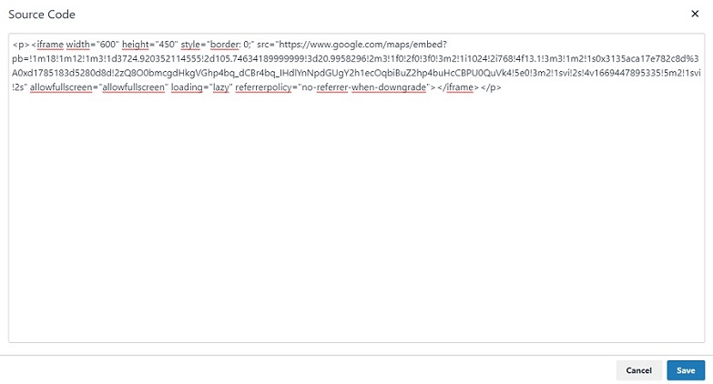
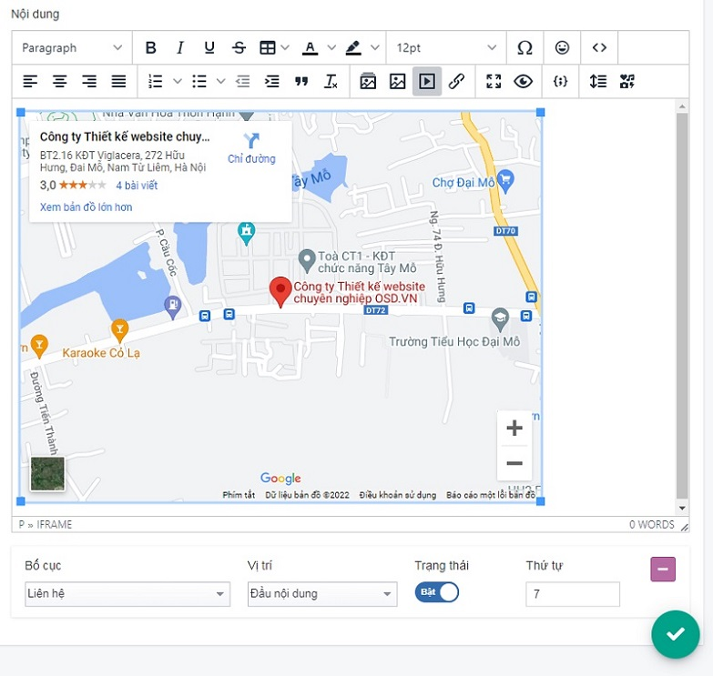

# Hướng dẫn nhúng bản đồ

Tại địa chỉ google map bạn nhấn chọn Chia sẻ -> Nhúng bản đồ (chọn kích thước tùy chỉnh) -> Sao chép mã HTML

Đồng thời vào trang admin, bạn nhấn chọn nút `Source code` sau đó dán đoạn mã HTML vừa copy vào và chọn **Save**

Sau khi hoàn tất, bạn cấu hình bố cục và ví trí hiển thị bản đồ trên website.

