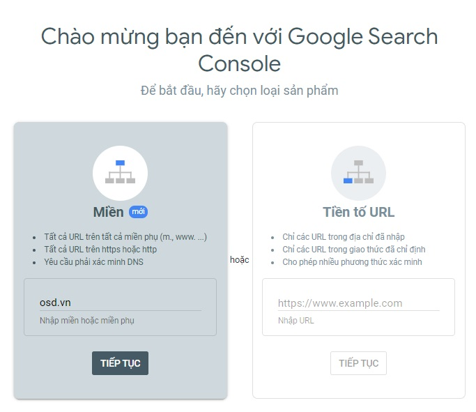
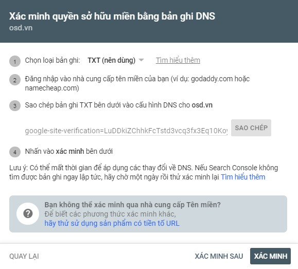
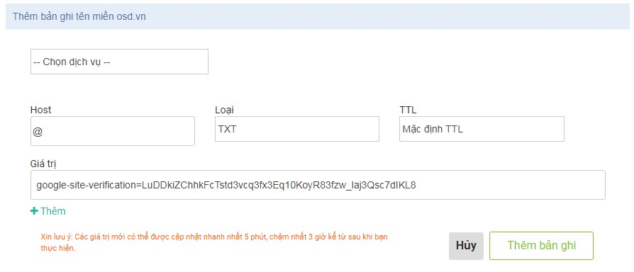
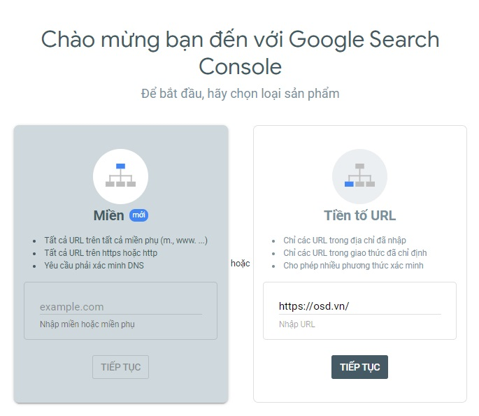
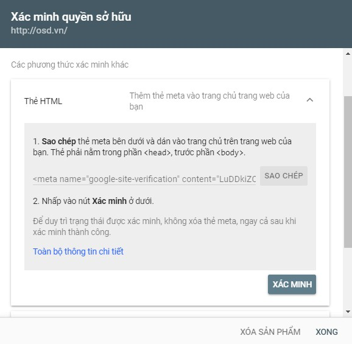
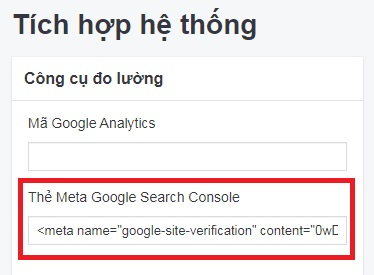
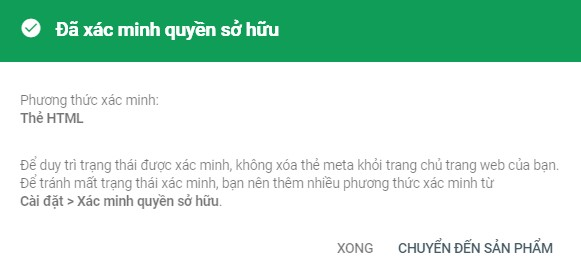
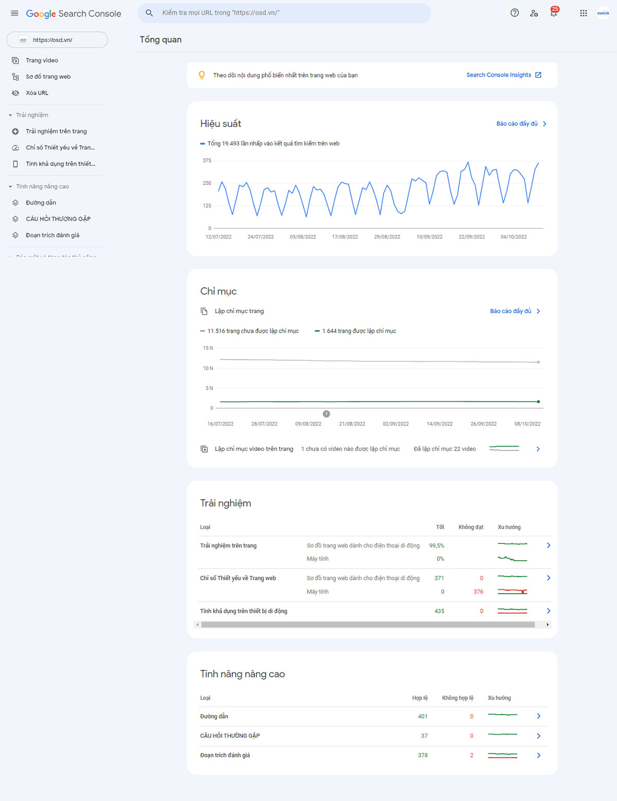

# Hướng dẫn tích hợp Google Search Console

Truy cập đường dẫn: [https://search.google.com/search-console/welcome](https://search.google.com/search-console/welcome) và đăng nhập vào tài khoản gmail của bạn.

Sau khi đăng nhập vào tài khoản gmail, có 2 cách xác minh như sau:

## Xác minh bằng tên miền (mới)

Với lựa chọn xác minh này, bạn nhập tên miền và bấm vào nút **Tiếp tục**.

Bạn sẽ được chuyển hướng xác minh quyền sở hữu miền bằng bản ghi DNS

- Chọn loại bản ghi: TXT
- Đăng nhập vào nhà cung cấp tên miền của bạn
- Sao chép bản ghi TXT và cấu hình bản ghi DNS tên miền như hình minh họa sau:

Phương thức xác minh này khá phức tạp, bạn có thể nhờ kỹ thuật viên xử lý hoặc xác minh bằng tiền tố URL.

Sau khi đã lưu file TXT record bạn chọn Verify để hoàn tất phần xác minh.

## Xác minh bằng tiền tố URL

> Phương thức xác minh khuyên dùng

Với lựa chọn xác minh tiền tố URL, bạn nhập địa chỉ URL website bao gồm https:// và bấm vào nút **Tiếp tục**.

Bạn sẽ được chuyển hướng xác minh theo hình thức này và có rất nhiều cách để bạn xác minh quyền sở hữu trang web như:

- **Tệp HTML:** Tải tệp HTML lên trang web của bạn
- **Thẻ HTML:** Thêm thẻ meta vào trang chủ trang web của bạn
- **Google Analytics:** Sử dụng tài khoản Google Analytics của bạn
- **Google Tag Manager:** Sử dụng tài khoản Trình quản lý thẻ của Google của bạn.

Mỗi phương pháp xác minh đều có hướng dẫn rất chi tiết, bạn chỉ cần làm theo hướng dẫn là có thể xác minh quyền sở hữu tên miền.

### Xác minh qua thẻ HTML

Cách thực hiện như sau:

Sao chép thẻ meta và dán vào trang chủ trên trang web của bạn. Thẻ phải nằm trong phần `head`, trước phần `body`.

Hoặc

Sao chép thẻ meta và truy cập quản trị web theo đường dẫn như sau: **Hệ thống -> Tích hợp -> Thẻ Meta Google Search Console** và dán thẻ meta vừa copy vào đây sau đó nhấn chọn nút (v) để lưu cập nhật thông tin.
  

Nhấn **Xác minh** trong Google Search Console và nhấn chọn **Chuyển đến sản phẩm**

Sau khi xác minh xong được chuyển hướng đến trang tổng quan chi tiết của sản phẩm như hình dưới đây:

  
_Chúc bạn thành công!_