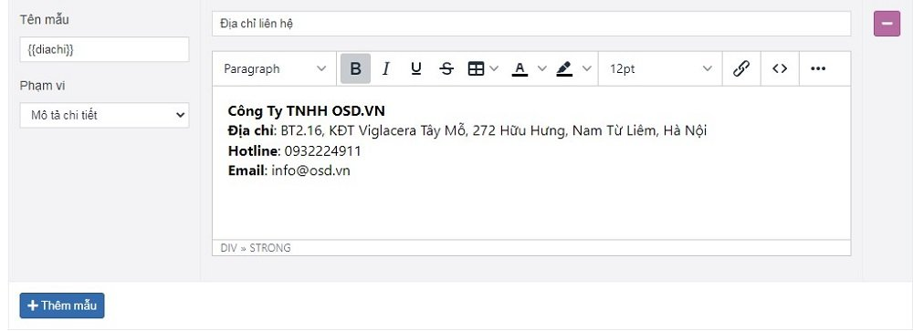
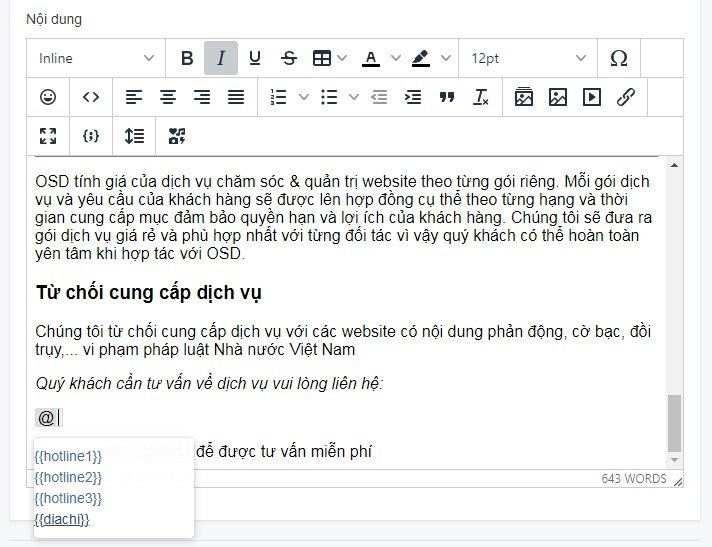
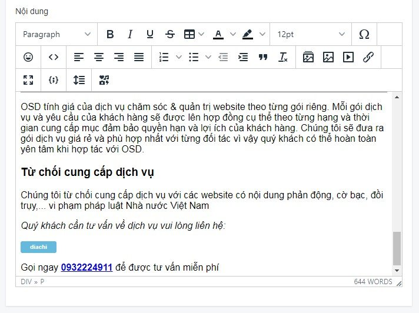
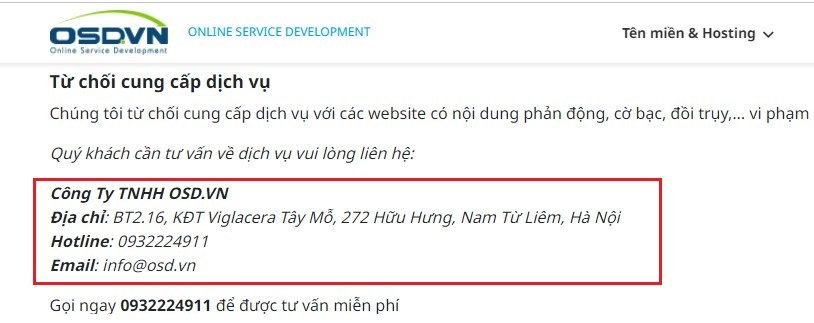

# Quản lý Mẫu nội dung
Chức năng này sử dụng để thay thế tự động thông tin trong tương lai dễ bị thay đổi trong phần nội dung tin bài. Với nhiều giao diện khác nhau, mẫu nội dung còn được ứng dụng vào các tình huống popup, tab,...

## Thêm mẫu nội dung

Tại màn hình quản trị, bạn chọn **Hệ thống -> Quản lý mẫu -> Mẫu nội dung -> Thêm mẫu**

Thông tin chi tiết có ý nghĩa như sau:

**Tên mẫu**

Nhập tên ký hiệu biến ngắn gọn _(ví dụ: `{{diachi}}` )_

**Nội dung cần thay thế**

Nhập tiêu đề và nội dung hiển thị trên website

**Phạm vi**

Phạm vi bố cục hiển thị mẫu nội dung này. Tại đây hệ thống cho phép lựa chọn 4 tab hiển thị 4 bố cục khác nhau: **_Nội dung chi tiết, Tab dịch vụ_**

## Hướng dẫn nhanh điền mẫu nội dung trong thông tin bài viết

Truy cập vài bài viết muốn hiển thị mẫu nội dung tự động:

Nhập tên biến  đã tạo tại **Mẫu nội dung** vào trình soạn thảo của bài viết bằng cách gõ @ tại nơi muốn hiển thị mẫu nội dung, hệ thống sẽ gợi ý các mẫu nội dung cho bạn lựa chọn như sau:

Sau khi dán tên biến vào form trình soạn thảo, màn hình sẽ hiển thị minh họa như sau:

Bạn nhập tên biến ở vị trí nào sẽ hiển thị tên biến ở vị trí đó trong bài viết. Khi xem ngoài wesbite mẫu nội dung được hiển thị như sau:

Nhấn chọn **Lưu** để hoàn tất.

## Xóa mẫu nội dung

Để xóa một mẫu nội dung, nhấn chọn nút **Xóa** tại mẫu nội dung đó

Hệ thống xác nhận bạn có chắc chắn muốn xóa không với nội dung như sau **Xóa bỏ là hành động sẽ không phục hồi lại được dữ liệu! Bạn có chắc chắn muốn thực hiện việc này?**. Bạn chọn **OK** để xóa chi nhánh đó.

## Sửa mẫu nội dung

Để sửa một mẫu nội dung, nhấn chọn sửa tại mẫu nội dung đó.

Sau khi thay đổi các thông tin nội dung của bài viết cần chọn **Lưu** để cập nhật những thay đổi.
